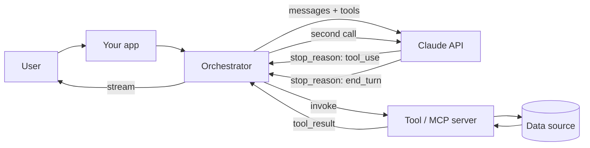

# Claude AI (Anthropic): Zero to Architect

An engineering course on building production systems with **Claude** - the API, prompting, tool use, agents,
multi-agent design, Claude Code, Skills, MCP, evaluation and cost control.

> Written by **Himanshu Kumar**. Part of [AI / ML / LLM / Agents: Zero to Architect](../README.md).

**Animated course site:** open [`index.html`](index.html) in a browser (or via GitHub Pages).
The HTML version carries the animated flow diagrams - request paths, agent loops, and the failure lane next to
every happy path.

**Reading on GitHub?** Every lesson also exists as plain Markdown with Mermaid diagrams:
**[md/README.md](md/README.md)** - no download, no browser needed, renders inline right here.

**Coverage:** every course in [Claude Academy](https://academy.claude.com/courses) - all four collections plus the
tutorial library - is mapped to a module here in [`academy-map.html`](academy-map.html), including an honest note on
where the official source is the better place to learn something.

---

## Why this exists

Most Claude material stops at "here is a prompt, here is the reply". That is the easy 20%. The other 80% is:

- What happens when the tool call times out mid-agent-loop
- Why turn 20 of a chat costs 40x turn 1
- How you prove a prompt change did not regress anything
- Where the model ends and your orchestrator's responsibility begins

This course is written from that side of the line.

---

## Modules

| # | Module | Status |
|---|--------|--------|
| 01 | [Claude models & the Messages API](lessons/01-models-and-api.html) | Live |
| 02 | [The Claude ecosystem: chat, Code, Cowork, plans](lessons/02-claude-ecosystem.html) | Live |
| 03 | [Claude Code fundamentals: agentic loop, install, first session](lessons/03-claude-code-fundamentals.html) | Live |
| 04 | [CLAUDE.md & context engineering](lessons/04-claude-md-context.html) | Live |
| 05 | [Modes, permissions, tools, hooks](lessons/05-modes-permissions-tools.html) | Live |
| 06 | [Sub-agents](lessons/06-subagents.html) | Live |
| 07 | [Agent views: many sessions, one screen](lessons/07-agent-views.html) | Live |
| 08 | [Agent teams (experimental)](lessons/08-agent-teams.html) | Live |
| 09 | [Skills: packaging a repeatable workflow](lessons/09-skills.html) | Live |
| 10 | [Plugins, marketplaces & MCP](lessons/10-plugins-mcp.html) | Live |
| 11 | [Cowork, Projects, Artifacts](lessons/11-cowork-projects-artifacts.html) | Live |
| 12 | [Evals, cost, safety & architecture case studies](lessons/12-evals-cost-architecture.html) | Live |
| 13 | [AI Fluency: the 4D framework](lessons/13-ai-fluency-4d.html) | Live |
| 14 | [AI capabilities & limitations: the four properties](lessons/14-ai-capabilities-limits.html) | Live |
| 15 | [Claude 101 in practice: everyday work](lessons/15-claude-101-everyday.html) | Live |
| 16 | [Prompt engineering that holds](lessons/16-prompt-engineering.html) | Live |
| 17 | [The Claude Platform: Console, agent loop, built-in tools](lessons/17-platform-console-agent-loop.html) | Live |
| 18 | [Tool use, RAG and agentic search](lessons/18-tool-use-rag.html) | Live |
| 19 | [Agents and workflows: architecture patterns](lessons/19-agents-workflows.html) | Live |
| 20 | [MCP advanced: sampling, roots, transports](lessons/20-mcp-advanced.html) | Live |
| 21 | [The AI-native SDLC](lessons/21-ai-native-sdlc.html) | Live |
| 22 | [Enterprise rollout: the five decisions](lessons/22-enterprise-rollout.html) | Live |
| 23 | [Claude on Bedrock and Vertex AI](lessons/23-bedrock-vertex.html) | Live |
| 24 | [Claude Code for Salesforce in VS Code](lessons/24-salesforce-claude-code.html) | Live |
| 25 | [Salesforce sub-agents, agent teams and skills](lessons/25-salesforce-agents-skills.html) | Live |
| - | [Claude Academy map](academy-map.html) - full official catalog mapped to these modules | Reference |

Every module follows the same six blocks: **mental model → mechanics → build it → what breaks → cost & latency →
interview drill**.

### Tracks

- **A - Fluency & foundations:** 13, 14, 15, 02, 11
- **B - Claude Code & agents:** 03, 04, 05, 06, 07, 08, 09, 10
- **C - API & platform:** 01, 16, 17, 18, 19, 23
- **D - MCP:** 10, 20
- **E - Delivery & enterprise:** 21, 22, 12
- **F - Salesforce:** 24, 25

---

## The shape of a Claude system



Claude never calls your tool. It *asks* for one. Your orchestrator executes it and hands the result back - so every
timeout, retry, permission check and audit log is your code.

---

## House rules

1. **No demo without an eval.** A prompt with no test is a bug waiting for a customer to find it.
2. **Cost and latency are logged from the first commit** - model, input/output tokens, cache reads, p95 latency.
3. **Model IDs live in config**, never inline. They get deprecated.
4. **Untrusted text is data, never instructions.**
5. **The failure path is documented next to the happy path**, always.

---

## Running the code

```bash
pip install anthropic
export ANTHROPIC_API_KEY="sk-ant-..."   # PowerShell: $env:ANTHROPIC_API_KEY="sk-ant-..."
python ask.py
```

Never commit a key, and never ship one to a browser or mobile client - a key in client code is a public key.

---

## A note on versions

Model names, context limits and prices change frequently. This course teaches the shapes and trade-offs that stay
stable. Always confirm current model IDs and rates in Anthropic's official documentation before you ship.
