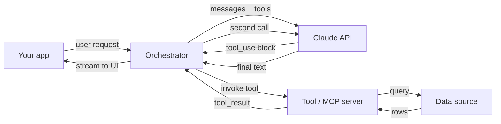
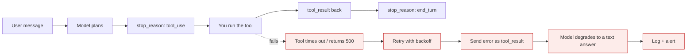

# Claude AI: Zero to Architect

*Anthropic · Claude*

Everything I use to build production systems on Claude - the API, prompting that survives real users, tool use, single and multi-agent design, Claude Code, Skills, MCP servers, evaluation harnesses, and the cost/latency maths that decides whether the thing ships.

## How this course is put together

Each module is one Markdown lesson you can read straight here on GitHub. Every lesson follows the same shape so you can skim it later like a reference card, not re-read it like a blog post.

| Block | What it gives you |
| --- | --- |
| **Mental model** | The one diagram that makes the rest obvious, drawn as a Mermaid flowchart with the failure path beside the happy path. |
| **Mechanics** | Exact request/response shapes, field names, and what the API actually returns. |
| **Build it** | Runnable code you can paste into a file and execute today. |
| **What breaks** | The failure path: error codes, retries, partial results, and the fallback you owe your users. |
| **Cost & latency** | Token maths, caching, and the trade you are actually making. |
| **Interview drill** | Questions a staff-level interviewer would ask, with the answer that scores. |

## The shape of a Claude system

Before any module, get this picture straight. Almost every Claude application is this loop with more or fewer boxes.

**Request path of a tool-using Claude app**

> **Why it matters:** Claude never calls your tool. It asks for one. Your orchestrator executes it and hands the result back - which means every retry, timeout and permission check is your code, not the model's.

**The agent loop, one turn at a time**

> **Why it matters:** A tool error is not an exception you swallow - it is content you send back to the model so it can recover or tell the truth.

> **NOTE - Prefer to read it as plain text?**
>
> **NOTE - Everything is Markdown**
>
> No downloads, no build step, no browser needed. Diagrams are Mermaid, which GitHub renders inline. Start at [module 01](lessons/01-models-and-api.md) or jump anywhere from the lists below.

> **NOTE - Mapped against the official curriculum**
>
> Every course in [Claude Academy](https://academy.claude.com/courses) - all four collections and the tutorial library - is mapped to a module here, with an honest note where the source material is better. See the [Claude Academy map](academy-map.md).

## Part 1 · Foundations, Claude Code & agents

### [Claude models & the Messages API](lessons/01-models-and-api.md) &nbsp; `Start here`
`MODULE 01`

Model families and when each one is the right call. Messages API end to end.

- system vs user vs assistant roles
- content blocks, stop_reason, usage
- streaming, temperature, max_tokens
- token maths and how billing really works

### [The Claude ecosystem](lessons/02-claude-ecosystem.md)
`MODULE 02`

Chat, Claude Code, Cowork, desktop, extensions, API - and which door to open.

- what each surface is genuinely good at
- plans, limits, and what burns them fastest
- subscription cost vs per-token cost
- the trust decision before you grant folder access

### [Claude Code fundamentals](lessons/03-claude-code-fundamentals.md)
`MODULE 03`

The agentic loop, install on any OS, IDE + terminal, and your first real session.

- gather context → act → verify → repeat
- install, doctor, login, folder trust
- the commands worth learning on day one
- resume, continue, and headless `claude -p`

### [CLAUDE.md & context engineering](lessons/04-claude-md-context.md)
`MODULE 04`

The memory hierarchy, `/init`, reading `/context`, and compaction.

- project / personal / global memory files
- what belongs in it - and what never does
- reading the context breakdown
- habits that keep an agent sharp

### [Modes, permissions, tools, hooks](lessons/05-modes-permissions-tools.md)
`MODULE 05`

Plan mode, allow/ask/deny rules, hooks as hard gates, custom slash commands.

- Shift+Tab modes and their real risk
- settings.json permission design
- hooks: deterministic, not suggested
- prompt injection defence in depth

### [Sub-agents](lessons/06-subagents.md)
`MODULE 06`

Delegation with a clean context: create, scope, run, and know when not to.

- built-in agents and `/agents`
- the `.claude/agents` file format
- read-only reviewers vs editors
- description = the routing mechanism

### [Agent views](lessons/07-agent-views.md)
`MODULE 07`

Many parallel sessions on one screen: working, needs input, completed.

- `claude agents` and `/bg`
- what to parallelise - and what collides
- worktrees for write-heavy tasks
- why review becomes the new bottleneck

### [Agent teams](lessons/08-agent-teams.md) &nbsp; `Experimental`
`MODULE 08`

Persistent teammates, a shared task list, and peer-to-peer messaging.

- hierarchy vs collaborative structure
- the experimental flag and the primitives
- dependencies and blocked tasks
- why coordination costs real money

### [Skills](lessons/09-skills.md)
`MODULE 09`

Package a repeatable workflow as SKILL.md, loaded only when it is needed.

- progressive disclosure explained
- frontmatter, steps, output contract
- skill vs sub-agent vs slash command
- skills that call plugins - with fallbacks

### [Plugins, marketplaces & MCP](lessons/10-plugins-mcp.md)
`MODULE 10`

Capability, not just instructions: live docs, deep search, your own systems.

- installing and authenticating plugins
- MCP client, server, transport, tools
- building a minimal MCP server
- the supply-chain threat model

### [Cowork, Projects, Artifacts](lessons/11-cowork-projects-artifacts.md)
`MODULE 11`

Agentic work outside code - for analysts, managers and non-developers.

- an agent pointed at a folder of documents
- Projects as reusable shared context
- artifacts you can actually review
- verification without writing any code

### [Evals, cost, safety & architecture](lessons/12-evals-cost-architecture.md) &nbsp; `Capstone`
`MODULE 12`

The module that decides if any of it ships - plus three case studies.

- golden sets, LLM-as-judge, task success rate
- cost levers and per-task budgets
- production safety checklist
- staff-level interview bank

## Part 2 · Fluency, platform, API, MCP & enterprise

Built from the full Claude Academy catalog - AI fluency, the platform and API deep dive, advanced MCP, the AI-native SDLC and enterprise rollout.

### [AI Fluency: the 4D framework](lessons/13-ai-fluency-4d.md)
`MODULE 13 · TRACK A`

Delegation, Description, Discernment, Diligence - the competencies that outlive every model release.

- automation vs augmentation vs agency
- product / process / performance description
- the Description-Discernment loop
- AI diligence statements

### [Capabilities & limitations](lessons/14-ai-capabilities-limits.md)
`MODULE 14 · TRACK A`

Four properties that explain almost every surprising thing a model does.

- next-token prediction and where fabrication lives
- knowledge, working memory, steerability
- sycophancy, verbosity, over-caution
- a diagnostic for any bad output

### [Claude 101 in practice](lessons/15-claude-101-everyday.md)
`MODULE 15 · TRACK A`

Everyday work: the three shapes of work, Projects, Artifacts, Connectors, Research.

- chat vs hand-off vs building software
- a first conversation worth having
- Enterprise Search and permission risk
- role-based starting points

### [Prompt engineering that holds](lessons/16-prompt-engineering.md)
`MODULE 16 · TRACK C`

Structure over cleverness, and an eval loop so you can prove a change helped.

- XML tags, examples, prefill, chain of thought
- extended thinking: when it pays
- structured output that actually parses
- code-based vs model-based grading

### [The Claude Platform](lessons/17-platform-console-agent-loop.md)
`MODULE 17 · TRACK C`

Console, model choice by measurement, and the agent loop written by hand.

- workspaces, keys, spend limits, evaluate tab
- hand-rolled loop, then the Tool Runner
- built-in tools: search, fetch, code execution
- context patterns and managed agents

### [Tool use, RAG & agentic search](lessons/18-tool-use-rag.md)
`MODULE 18 · TRACK C`

Schema design, then production retrieval that actually finds the right passage.

- chunking, embeddings, BM25, hybrid fusion
- multi-index, reranking, contextual retrieval
- citations, vision, PDFs
- caching and batch ingestion

### [Agents & workflows](lessons/19-agents-workflows.md)
`MODULE 19 · TRACK C`

Six architecture patterns - and why most projects should pick the simpler one.

- chaining, routing, parallelisation
- orchestrator-worker, evaluator-optimiser
- computer use and where it belongs
- debugging by trajectory, not by vibes

### [MCP: advanced topics](lessons/20-mcp-advanced.md)
`MODULE 20 · TRACK D`

The protocol itself: sampling, notifications, roots, transports, scaling.

- sampling - servers borrowing the client's model
- progress notifications and roots
- stdio handshake and the stdout trap
- stateful vs stateless HTTP trade-off

### [The AI-native SDLC](lessons/21-ai-native-sdlc.md)
`MODULE 21 · TRACK E`

When code generation gets 10x faster, review becomes the bottleneck. Fix the process.

- intent.md before any code
- knowledge as versioned machine-readable files
- deterministic / agentic / human review layers
- hooks as governance gates, control bands

### [Enterprise rollout](lessons/22-enterprise-rollout.md)
`MODULE 22 · TRACK E`

The five decisions that decide whether Claude becomes infrastructure or shelfware.

- structure & identity, access, governance
- spend caps and chargeback
- visibility and audit
- how each decision cascades

### [Bedrock & Vertex AI](lessons/23-bedrock-vertex.md)
`MODULE 23 · TRACK C`

Same models, different front door: auth, regions, residency, parity.

- IAM / service accounts instead of API keys
- cross-region inference as a compliance control
- the feature-parity lag
- a portable client seam in 8 lines

### [Claude Academy map](academy-map.md) &nbsp; `Index`
`REFERENCE`

The full official catalog mapped to these modules, plus suggested learning paths.

- 4 collections, 22 courses, 14 tutorials
- section-level mapping of the 67-lesson API course
- where to go to the source instead
- paths by role and by goal

## Part 3 · Track F · Salesforce

Applying all of the above to a Salesforce DX codebase in VS Code - where the governor limits, mandatory tests and risky deployments make agentic discipline mandatory rather than optional.

### [Claude Code for Salesforce in VS Code](lessons/24-salesforce-claude-code.md)
`MODULE 24 · TRACK F`

Extension pack, sf CLI, CLAUDE.md for Apex and LWC, and the permission rules that protect your org.

- SFDX project setup and metadata scoping
- allow / ask / deny for every sf command
- hook that blocks production deployments
- the `sf org display` access-token trap

### [Salesforce agents, teams & skills](lessons/25-salesforce-agents-skills.md)
`MODULE 25 · TRACK F`

Explore a legacy org, review Apex like an architect, ship a story with a team, standardise with skills.

- Explore agent for an org you inherited
- read-only apex-reviewer with the full checklist
- agent team for one release story
- skills invoked from the VS Code terminal

> **NOTE - Engineering rule for this course**
>
> Nothing gets a demo until it has an evaluation, and anything that calls a model gets its cost and latency tracked from the first commit. A prompt without a test is a bug waiting for a customer to find it.

> **WARNING - On versions and prices**
>
> Model names, context limits and pricing change often. This course teaches the shapes and trade-offs that stay stable; always confirm the current model IDs and rates in Anthropic's official documentation before you ship.

---

Part of [AI / ML / LLM / Agents: Zero to Architect](../README.md) · written by Himanshu Kumar.
