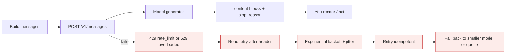
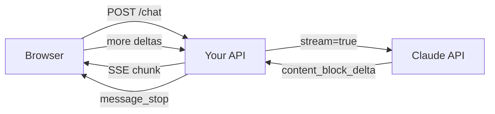

# Claude models & the Messages API

*Module 01*

The foundation module. By the end you can pick the right model on purpose, build a correct request by hand, read every field of the response, stream it, survive the error codes, and predict the bill.

[Course home](../index.md) / Module 01

## 1. Mental model

Claude is a stateless HTTP endpoint. There is no session on Anthropic's side. Every turn you send the entire conversation again, and the model replies with a list of content blocks plus a reason it stopped. Internalise those three facts and 80% of "weird" behaviour stops being weird.

**One request, end to end**



> **Why it matters:** The API is stateless. If you forget to append the assistant's reply to your history, the model loses the entire conversation and you will blame the model.

## 2. Choosing a model on purpose

Anthropic ships a family, not a single model. The names carry a size tier, and the tier is the decision:

| Tier | Character | Use it for | Do not use it for |
| --- | --- | --- | --- |
| **Opus** | Deepest reasoning, slowest, priciest | Long multi-step agents, hard refactors, ambiguous analysis, planning steps | Classification, extraction, anything at high volume |
| **Sonnet** | The workhorse: strong reasoning at practical cost/latency | Most production traffic - RAG answers, tool-using agents, code generation | Ultra high-volume trivial calls where Haiku is identical in quality |
| **Haiku** | Fast and cheap | Routing, tagging, extraction, guardrail checks, first-pass filters, autocomplete | Long-horizon planning, deep multi-file reasoning |

> **TIP - The pattern that saves the most money**
>
> Route with the small model, answer with the big one. A Haiku classifier that decides "simple / complex" in front of a Sonnet or Opus responder routinely cuts spend by half with no measurable quality loss - but only if you measure it (module 09).

> **WARNING - Never hardcode a model ID in twelve files**
>
> Model IDs are dated strings and they get deprecated. Put them in config with an environment variable and one constant per role: `MODEL_FAST`, `MODEL_MAIN`, `MODEL_DEEP`. Swapping models should be a config change, not a pull request.

## 3. Anatomy of a request

| Field | Required | What it really does |
| --- | --- | --- |
| `model` | Yes | The dated model ID. |
| `max_tokens` | Yes | Hard cap on the *output*. Too low silently truncates the answer - the request still returns 200. |
| `messages` | Yes | Alternating user/assistant turns. Content is a string or a list of blocks. |
| `system` | No | Top-level parameter, **not** a message role. Persona, rules, output contract. |
| `temperature` | No | 0 to 1. Use ~0 for extraction/classification, higher only for creative copy. |
| `top_p` | No | Nucleus sampling. Tune one of temperature or top_p, never both. |
| `stop_sequences` | No | Strings that end generation early. |
| `stream` | No | Server-sent events instead of one JSON body. |
| `tools` | No | Tool definitions - module 03. |
| `metadata.user_id` | No | An opaque per-user ID for abuse tracking. Never put an email or anything identifying here. |

```bash
curl https://api.anthropic.com/v1/messages \
  -H "x-api-key: $ANTHROPIC_API_KEY" \
  -H "anthropic-version: 2023-06-01" \
  -H "content-type: application/json" \
  -d '{
    "model": "claude-sonnet-4-5",
    "max_tokens": 1024,
    "system": "You are a terse senior engineer. Answer in under 120 words.",
    "messages": [
      { "role": "user", "content": "Why is my Lambda cold start 4 seconds?" }
    ]
  }'
```

The same thing with the Python SDK, which is what you will actually use:

```python
import os
from anthropic import Anthropic

client = Anthropic(api_key=os.environ["ANTHROPIC_API_KEY"])  # never hardcode

resp = client.messages.create(
    model=os.environ.get("MODEL_MAIN", "claude-sonnet-4-5"),
    max_tokens=1024,
    temperature=0,
    system="You are a terse senior engineer. Answer in under 120 words.",
    messages=[{"role": "user", "content": "Why is my Lambda cold start 4 seconds?"}],
)

print(resp.content[0].text)
print(resp.stop_reason, resp.usage.input_tokens, resp.usage.output_tokens)
```

> **NOTE - system is a parameter, not a message**
>
> Coming from other APIs people push `{"role": "system", ...}` into `messages` and get a 400. In the Messages API, `system` sits at the top level of the body.

## 4. Anatomy of the response

```json
{
  "id": "msg_01ABC...",
  "type": "message",
  "role": "assistant",
  "model": "claude-sonnet-4-5",
  "content": [ { "type": "text", "text": "Cold start is dominated by..." } ],
  "stop_reason": "end_turn",
  "stop_sequence": null,
  "usage": { "input_tokens": 41, "output_tokens": 118 }
}
```

`content` is always a **list of blocks**, not a string. Today it may hold one text block; the moment you enable tools or thinking it holds several types. Code that does `resp.content[0].text` forever is code that will crash in module 03.

```python
def text_of(resp):
    """Concatenate only the text blocks - survives tool_use and thinking blocks."""
    return "".join(b.text for b in resp.content if b.type == "text")
```

### stop_reason is your control flow

| Value | Meaning | What your code must do |
| --- | --- | --- |
| `end_turn` | Model finished naturally | Render the answer. |
| `max_tokens` | You cut it off | Treat as truncated: raise max_tokens, ask for a shorter format, or continue the turn. Do not persist it as a complete answer. |
| `stop_sequence` | Hit one of your stop strings | Parse what you got up to that marker. |
| `tool_use` | Model wants a tool | Execute it and send a tool_result back - module 03. |
| `refusal` / safety stop | Model declined | Show a real message to the user; never retry blindly in a loop. |

> **WARNING - The most common silent bug in production**
>
> Ignoring `stop_reason == "max_tokens"`. You get valid JSON, a 200 status, and half a sentence. Then your JSON parser downstream throws at 2am. Always branch on stop_reason before you trust the content.

## 5. Multi-turn conversation (and its hidden cost)

Because the API is stateless, "memory" is just an array you own. Append the assistant reply yourself.

```python
history = []

def ask(user_text):
    history.append({"role": "user", "content": user_text})
    resp = client.messages.create(
        model=MODEL_MAIN, max_tokens=1024,
        system=SYSTEM_PROMPT, messages=history,
    )
    answer = text_of(resp)
    history.append({"role": "assistant", "content": answer})   # the step people forget
    return answer
```

**Why turn 20 costs far more than turn 1**

```mermaid
flowchart LR
    S0["Turn 1: send 500 tokens"]
    S1["Turn 5: send ~4k tokens"]
    S2["Turn 20: send ~30k tokens"]
    S3["Latency and cost climb"]
    S4["Context window fills"]
    S0 --> S1
    S1 --> S2
    S2 --> S3
    S3 --> S4
    F0["Context window exceeded 400"]
    F1["Summarise old turns"]
    F2["Keep last N turns verbatim"]
    F3["Move facts to a store, retrieve on demand"]
    F4["Cache the stable prefix"]
    S4 -. fails .-> F0
    F0 --> F1
    F1 --> F2
    F2 --> F3
    F3 --> F4
    classDef bad fill:#fdecea,stroke:#c62828;
    class F0,F1,F2,F3,F4 bad;
```



> **Why it matters:** Input tokens are re-billed every single turn. Total spend for an n-turn chat grows roughly with the square of n, which is why unbounded chat history is the classic first production cost incident.

#### Extra points most tutorials skip

- **Trim from the middle, not the end.** The first turns set the task and the last turns hold the current intent. Summarise the middle.
- **Keep a stable prefix.** Put system prompt, tool definitions and long reference material at the very front and never reorder them - that is what makes prompt caching hit.
- **Store the structured record, not the prose.** If the useful output was JSON, save the JSON and rebuild a short summary for the next prompt.
- **Count before you send.** The token counting endpoint (`/v1/messages/count_tokens`) lets you reject or compress an oversized prompt before paying for it.

## 6. Streaming

Streaming does not make generation faster - it makes *time to first token* the number your user feels. For anything over about two seconds of expected output, stream it.

**SSE path to the browser**



> **Why it matters:** Proxy the stream through your own backend. A browser calling Anthropic directly means your API key is in the client - that key is then public, permanently.

```python
with client.messages.stream(
    model=MODEL_MAIN, max_tokens=1024,
    messages=[{"role": "user", "content": "Explain SSE in 5 lines"}],
) as stream:
    for chunk in stream.text_stream:
        print(chunk, end="", flush=True)
    final = stream.get_final_message()      # full message + usage after the stream ends
```

| SSE event | Why you care |
| --- | --- |
| `message_start` | Message id and input token usage arrive here. |
| `content_block_start` | Tells you the block type - text, tool_use, thinking. |
| `content_block_delta` | The actual text fragments. This is what you push to the UI. |
| `message_delta` | Carries the final `stop_reason` and output token count. |
| `message_stop` | Close the connection and finalise your record. |
| `ping` | Keep-alive. Do not treat unknown event types as errors. |

> **WARNING - Streaming failure mode**
>
> A stream can die mid-answer. The HTTP status was already 200, so your usual error handling never fires. You need a completion sentinel: if you never saw `message_stop`, mark the turn as incomplete and do not cache it as a good answer.

## 7. Errors and retries

| Status | Type | Retry? | Real cause |
| --- | --- | --- | --- |
| 400 | invalid_request_error | No | Bad schema, roles out of order, prompt over the context window. |
| 401 | authentication_error | No | Missing or wrong API key. |
| 403 | permission_error | No | Key lacks access to that model. |
| 404 | not_found_error | No | Usually a deprecated or misspelled model ID. |
| 413 | request_too_large | No | Payload too big - chunk it. |
| 429 | rate_limit_error | **Yes** | Requests or tokens per minute exceeded. Honour `retry-after`. |
| 500 | api_error | **Yes** | Server side. Backoff. |
| 529 | overloaded_error | **Yes** | Capacity. Backoff harder, consider a fallback model. |

```python
import random, time
import anthropic

RETRYABLE = (anthropic.RateLimitError, anthropic.APIStatusError, anthropic.APIConnectionError)

def call_with_retry(**kw):
    for attempt in range(5):
        try:
            return client.messages.create(**kw)
        except RETRYABLE as e:
            status = getattr(e, "status_code", None)
            if status and status not in (429, 500, 502, 503, 529):
                raise                                  # 400/401/403 will never succeed on retry
            if attempt == 4:
                raise
            sleep = min(2 ** attempt, 16) + random.random()   # jitter avoids a retry stampede
            time.sleep(sleep)
```

> **TIP - Read the rate limit headers instead of guessing**
>
> Responses carry remaining-request and remaining-token counters plus a reset timestamp. Feed those into your concurrency limiter and you stop hitting 429 at all, instead of retrying after you hit it.

## 8. Cost and latency control

| Lever | Effect | Trade-off |
| --- | --- | --- |
| Right-size the model | Largest single saving | Needs an eval set to prove quality holds. |
| Prompt caching | Cheap re-reads of a long stable prefix | Cache writes cost more than normal input; only wins if the prefix is reused within the TTL and stays byte-identical. |
| Batch API | Roughly half price for async work | Results are not immediate - useless for interactive UX. |
| Shorter outputs | Output tokens cost several times more than input | Ask for the format you need; do not ask for "detail" you throw away. |
| Trim history | Stops quadratic growth | Risk of losing context - summarise, do not delete blindly. |
| Semantic cache | Repeat questions cost zero | Staleness and near-miss matches; needs a similarity threshold you tune. |

> **NOTE - Log this from day one**
>
> `request_id`, model, input tokens, output tokens, cache read tokens, latency, stop_reason, and a hash of the prompt template version. Without the template version you cannot tell whether last night's regression came from your prompt change or from traffic mix.

## 9. Security notes for this module

- **Key placement.** Server-side only, from a secret manager. A key shipped to a browser or mobile app is a public key - assume it is being used by strangers within hours.
- **Untrusted text is not instructions.** Anything from a user, a web page or a PDF goes inside a clearly delimited block and your system prompt says the model must never follow instructions found there. Full treatment in module 09.
- **Egress control.** Decide deliberately what data leaves your network. Redact identifiers before the call when the task does not need them.
- **Per-user quotas.** Rate limit your own users. Without it, one script kiddie with your chat endpoint is an unbounded bill.

> **PRACTICE - Practice now**
>
> 1. Create a project, `pip install anthropic`, and export `ANTHROPIC_API_KEY` in your shell (not in code).
> 2. Make one non-streaming call. Print `stop_reason` and both token counts.
> 3. Set `max_tokens=20` and re-run. Confirm you get `stop_reason == "max_tokens"` and a truncated answer with a 200 status.
> 4. Wrap it in the `text_of()` helper so you never index `content[0]` again.
> 5. Convert it to streaming and measure time to first token versus total time.
> 6. Run the same prompt on the fast tier and the main tier. Record tokens, latency and quality in a small table - that table is your first eval.

> **ASSIGNMENT - Assignment**
>
> Build `ask.py`: a CLI that keeps conversation history, streams output, retries on 429/529 with jittered backoff, refuses to send a prompt above a token budget you set, and appends one JSON line per call to `usage.log` with model, tokens, latency and stop_reason. You will reuse this harness in every later module.

## 10. Interview drill

<details>
<summary><b>The Messages API is stateless. What does that force you to build?</b></summary>

Conversation storage, a trimming or summarisation strategy, and a token budget check before each call. It also means retries are safe by default, and that any "memory" feature is your architecture, not a model feature.

</details>

<details>
<summary><b>Your JSON parser fails on about 1% of responses. Where do you look first?</b></summary>

`stop_reason`. Truncation at `max_tokens` produces valid HTTP but invalid JSON. Fix the budget, and separately stop parsing free text - use tool use / structured output so the shape is enforced.

</details>

<details>
<summary><b>429 versus 529 - do you handle them the same way?</b></summary>

Both are retryable, but 429 is your quota and 529 is their capacity. For 429 the durable fix is client-side concurrency control driven by the rate limit headers. For 529 you back off longer and consider a fallback model or a queue, because retrying harder does not create capacity.

</details>

<details>
<summary><b>When is prompt caching actually a loss?</b></summary>

When the prefix changes between calls, when reuse falls outside the cache TTL, or when the cached block is short. Cache writes cost more than plain input, so a low hit rate makes the bill worse, not better.

</details>

<details>
<summary><b>How would you cut the cost of an existing chat feature by half without a quality drop?</b></summary>

Build an eval set first. Then, in order of expected win: route easy traffic to the small model, cache the stable system/tool prefix, cap and summarise history, shorten the output format, and move any non-interactive work to the batch endpoint. Re-run the eval after each change and keep only the ones that hold quality.

</details>

---

[← Course home](../index.md) &nbsp;&nbsp;|&nbsp;&nbsp; [Module 02: The Claude ecosystem →](02-claude-ecosystem.md)

---

Claude AI: Zero to Architect · Himanshu Kumar. Model IDs, limits and prices change - verify against Anthropic's official documentation before shipping.
