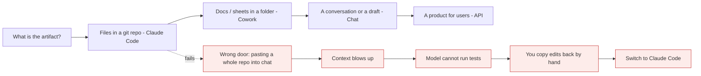

# The Claude ecosystem

*Module 02*

Same model, many doors. Chat, Claude Code, Cowork, the desktop app, browser and workspace extensions, and the raw API each solve a different job. Pick the wrong door and the work takes three times longer.

[Course home](../index.md) / Module 02

## 1. The map

| Surface | Lives in | Best at | Weak at |
| --- | --- | --- | --- |
| **Claude chat** (web / desktop / mobile) | Browser or app | Thinking, drafting, explaining, one-off analysis, Projects with shared knowledge | Touching your real repo |
| **Claude Code** | Terminal + IDE extension | Reading a codebase, editing files, running tests, git work, long agentic tasks | Non-technical users; work that has no files |
| **Cowork** | Desktop app, pointed at a folder | Documents, spreadsheets, invoices, reports - agentic work for non-developers | Deep code refactors |
| **Extensions** (browser, workspace tools) | Where you already work | Context from the page or the thread you are in | Long multi-step autonomy |
| **API / Agent SDK** | Your code | Products you ship to your own users | Ad-hoc personal productivity |

**Which door do I open?**

> **Why it matters:** The question is never 'which is best'. It is 'where does the work already live'. Take the model to the work, not the work to the model.

## 2. Claude Code, in one paragraph

An **agentic coding tool** that runs in your terminal (and inside VS Code / Cursor). Give it a folder and it can read your codebase, edit files, run commands, call your dev tools, and loop until the task is done - with your approval at each risky step. It is not autocomplete. Autocomplete finishes your line; Claude Code finishes your ticket. Modules 03 to 10 are all about it.

> **TIP - The underrated first use case**
>
> You join a team and inherit a running project. Instead of booking two hours of someone's calendar, open the repo and ask for a walkthrough. You get a knowledge transfer on demand, at 2am, in as much detail as you want. That alone pays for the subscription in week one.

## 3. Cowork, in one paragraph

A desktop agent for work that is *not* code. Point it at a folder - invoices, spreadsheets, PDFs, reports - and ask for the outcome you want. It plans, uses tools, asks clarifying questions, and produces files. Same agentic loop, different material. Module 11 covers it, including for non-developers.

## 4. Plans and what actually limits you

| Plan | Roughly who | Gets you |
| --- | --- | --- |
| **Free** | Trying it out | Chat on web/desktop/mobile, limited usage. |
| **Pro** | Individuals; cheaper annually | Higher limits, Claude Code access for normal daily work. |
| **Max (5x / 20x)** | Heavy agentic users | Multiples of Pro usage. If you run agents all day, this is the tier that stops you hitting the wall at 3pm. |
| **Team / Enterprise** | Companies | Seat management, admin controls, policy settings, compliance features. |
| **API (pay as you go)** | Products you build | Per-token billing, no subscription, full programmatic control. |

> **WARNING - Two different meters**
>
> A subscription covers *you* using Claude Code and the apps. An API key bills *your product* per token. Do not mix them up in a business case: an agent your team uses is a subscription cost; an agent your customers use is a variable cost that scales with traffic. Prices and limits change - check the current pricing page.

#### What burns your limit fastest

- **Big context.** A 1M-token window is a permission, not a plan. Every turn re-reads what is in it.
- **Parallel agents.** Three teammates working at once cost roughly three times one.
- **Deep-tier models on shallow tasks.** Renaming a variable does not need the reasoning tier.
- **Restarting instead of resuming.** A fresh session re-reads the project from scratch.

## 5. Before you go further: the trust decision

Every one of these surfaces asks for access to something - a folder, a repo, a browser tab, a workspace. That is the actual security decision, and it is yours:

| Question | Why it matters |
| --- | --- |
| What is in this folder? | Secrets, customer data and .env files are read like any other file. Scope the folder, do not point it at your home directory. |
| Who wrote the code I am about to let it run? | Untrusted repos can contain instructions aimed at the agent, not at you. Prompt injection is a supply-chain problem now. |
| What does my employer allow? | Consumer and commercial plans have different data handling. Check policy before pointing anything at client code. |
| Which actions need a human? | Reading is cheap to undo. Writing, deleting, pushing and paying are not. Module 05 turns this into permission rules. |

> **PRACTICE - Practice now**
>
> 1. Install the Claude desktop app and sign in.
> 2. Open a throwaway folder in Cowork and ask it to summarise what is inside. Watch it plan before it acts.
> 3. Write down, in one line each, which surface you would use for: fixing a failing test, summarising 40 invoices, drafting a design doc, and shipping a chatbot to customers.
> 4. Check your plan's usage page and note where the limits actually are.

## 6. Interview drill

<b>Your manager asks "should we buy seats or use the API?"</b>

Both, for different things. Seats for internal productivity - fixed, predictable, per person. API for anything customer-facing, because that cost scales with your traffic and needs its own budget, caching strategy and rate limiting. Answering "just use the API for everything" misses that a developer's daily agent work on a subscription is far simpler to forecast.

<b>A non-technical colleague wants to automate a monthly report. What do you recommend?</b>

Cowork with a scoped folder, plus a written instruction file so the format is repeatable. Do not build them a custom app first - prove the workflow with the agent, then automate the parts that turn out to be stable.

<b>What is the first thing you check before pointing any of this at client code?</b>

Data handling policy and contract terms, then folder scope. Technical capability is not the blocker; permission is.

---

[← Module 01](01-models-and-api.md) &nbsp;&nbsp;|&nbsp;&nbsp; [Module 03: Claude Code fundamentals →](03-claude-code-fundamentals.md)

---

Claude AI: Zero to Architect · Himanshu Kumar. Plans and limits change - verify on the official pricing page.
