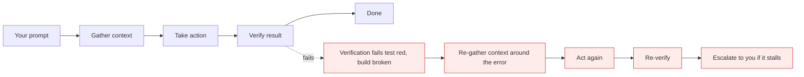
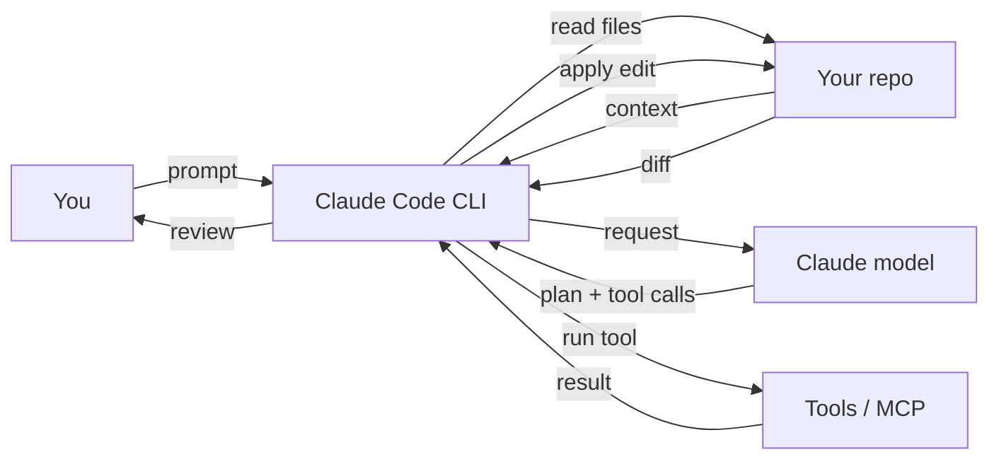

# Claude Code fundamentals

*Module 03*

The agentic loop that runs underneath everything, how to install it on any OS, how to wire it into your IDE, and how to drive a session without wasting half your context on the first prompt.

[Course home](../index.md) / Module 03

## 1. What it actually is

Claude Code is an **agentic harness around the model**. The model on its own can only produce text. The harness gives it a tool set (read, write, edit, bash, search, web fetch, sub-agents, MCP), a context manager, and an execution environment. That combination is what turns a language model into a coding agent.

Everything it does runs through one loop:

**The agentic loop**



> **Why it matters:** You are inside this loop, not outside it. You can interrupt at any point, add context, change the model, or rewrite the instruction - and the loop picks up from there.

| Stage | What happens | Where you influence it |
| --- | --- | --- |
| **Gather context** | Reads files, greps, lists directories, loads memory files and skills | CLAUDE.md, pointing at exact files, scoping the folder (module 04) |
| **Take action** | Edits files, runs commands, calls tools and sub-agents | Permission rules and modes (module 05) |
| **Verify** | Runs the tests, re-reads the diff, checks the build | Give it a real verification command - this is the single biggest quality lever |

> **TIP - The rule that changes your results most**
>
> An agent with no way to verify is guessing. Tell it the command that proves success - `pytest -q`, `npm test`, `ruff check .` - and put that command in CLAUDE.md. A loop that can check itself will fix its own mistakes before you ever see them.

## 2. Install

| Platform | Command |
| --- | --- |
| macOS / Linux / WSL | `curl -fsSL https://claude.ai/install.sh \| bash` |
| Windows PowerShell | `irm https://claude.ai/install.ps1 \| iex` |
| Any OS with Node 18+ | `npm install -g @anthropic-ai/claude-code` |

Then verify and diagnose:

```bash
claude --version
claude doctor        # checks install health, permissions, IDE integration
claude update        # update to the latest version
```

> **WARNING - Piping a script from the internet into your shell**
>
> `curl ... | bash` and `irm ... | iex` execute whatever the server returns. That is fine for a vendor you have decided to trust, and not fine as a habit. In a locked-down environment, download the script, read it, then run it - or install via your package manager. Never run an install one-liner you got from a forum post.

## 3. Log in

Two ways to authenticate, and they bill differently:

| Method | How | When |
| --- | --- | --- |
| Subscription (Pro / Max / Team) | `/login`, browser authorises the CLI | Your own daily work. Predictable monthly cost. |
| API key | `ANTHROPIC_API_KEY` environment variable | CI pipelines, shared automation, per-token accounting. |

First run also asks you to **trust the folder**. That prompt is a security boundary, not a formality - say no to any repo you did not clone yourself and have not looked at.

## 4. IDE and terminal

Two ways to drive it, and most people end up using both:

- **Terminal in your project root.** Type `claude`. This is the full experience.
- **Inside VS Code or Cursor.** Install the extension and run it from the integrated terminal - you get diffs in the editor and file references from your selection.

**Where the session lives**



> **Why it matters:** The CLI is the only thing touching your disk. The model sees what the CLI sends it - which is why folder scope and CLAUDE.md matter more than prompt wording.

## 5. Your first session, done properly

```bash
cd path/to/your/project
claude

# then, inside the session:
> explain this project: structure, entry points, how to run it, and anything unusual
```

Watch what it does: lists directories, reads the README and config, may ask permission to run a shell command, and returns a walkthrough. That is the loop's first stage doing its job.

#### Commands worth learning on day one

| Command | Does |
| --- | --- |
| `/init` | Analyses the repo and writes a CLAUDE.md. Run this early (module 04). |
| `/context` | Visual breakdown of what is filling the context window. |
| `/model` | Switch tier mid-session - deep tier to plan, fast tier to execute. |
| `/clear` | Wipe the conversation. Use it between unrelated tasks, constantly. |
| `/compact` | Summarise the conversation to reclaim space. |
| `/agents`, `/plugins`, `/mcp` | Sub-agents, plugins, MCP servers (modules 06, 10). |
| `/status`, `/cost`, `/doctor` | Session state, spend, install health. |
| `Esc` | Interrupt mid-action. Learn this before you need it. |
| `Shift+Tab` | Cycle permission modes - plan, accept edits, and back (module 05). |

## 6. Sessions across time

```bash
claude -c            # continue the most recent conversation
claude -r            # pick from a list of past sessions and resume with context
claude -p "run the test suite and summarise failures"   # headless: one shot, prints and exits
```

`claude -p` is the one people miss. It makes Claude Code scriptable - CI steps, git hooks, cron jobs, "explain this diff" in a PR pipeline. It is the bridge between interactive help and automation.

> **WARNING - Resume is not free**
>
> Resuming reloads the old context, including the parts that are now irrelevant. For a genuinely new task, a clean session plus a good CLAUDE.md beats resuming a stale one - it is cheaper and the answers are sharper.

#### Extra points from experience

- **One task per session.** Mixed conversations produce mixed reasoning. `/clear` is free.
- **Ask for a plan before an edit** on anything non-trivial. Reviewing a plan takes 30 seconds; reviewing a 200-line diff takes 20 minutes.
- **Work on a branch.** Agentic edits are much easier to evaluate as a diff you can throw away.
- **Use git worktrees** to run two agents on the same repo without them fighting over the same files.
- **Say "do not write code yet"** when you are exploring. Otherwise a question becomes a pull request.
- **Read the bash prompts.** The approval dialog is your last checkpoint before something runs.

> **PRACTICE - Practice now**
>
> 1. Install Claude Code and run `claude doctor`.
> 2. Open a real repo you did not write. Ask for a full walkthrough.
> 3. Run `/context` and note what is already consuming the window before you have done anything.
> 4. Start a task, press `Esc` mid-action, redirect it, and watch the loop pick up your correction.
> 5. Run `claude -p "list the three riskiest files in this repo and why"` from your shell and pipe the output to a file.

> **ASSIGNMENT - Assignment**
>
> Take a repo you inherited or one from GitHub. Without opening a single file yourself, produce a one-page architecture summary using only Claude Code: entry points, data flow, external dependencies, test command, and the three things you would fix first. Then open the code and grade the summary. What it got wrong tells you exactly what belongs in CLAUDE.md - which is module 04.

## 7. Interview drill

<details>
<summary><b>Explain the agentic loop and where a human fits.</b></summary>

Gather context, act, verify, repeat until done. The human sets the goal, approves risky actions, can interrupt and add context at any iteration, and owns the definition of "verified". The loop is what separates an agent from a single completion call.

</details>

<details>
<summary><b>Why does giving the agent a test command matter so much?</b></summary>

It closes the verification stage. Without it the loop cannot self-correct and every error surfaces to you. With it, the agent iterates against ground truth instead of its own opinion.

</details>

<details>
<summary><b>When do you use headless mode?</b></summary>

Anywhere there is no human at the keyboard: CI checks, PR summaries, scheduled maintenance, bulk refactors across repos. Pair it with tight permission rules, because nobody is there to click approve.

</details>

<details>
<summary><b>Two developers, one repo, both running agents. What breaks?</b></summary>

Concurrent edits to the same files and conflicting test runs. Use separate branches or git worktrees so each agent has its own working tree.

</details>

---

[← Module 02](02-claude-ecosystem.md) &nbsp;&nbsp;|&nbsp;&nbsp; [Module 04: CLAUDE.md & context →](04-claude-md-context.md)

---

Claude AI: Zero to Architect · Himanshu Kumar. Install commands and flags change - confirm in the official Claude Code docs.
