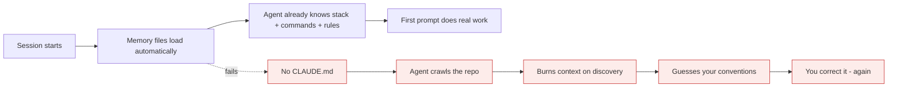
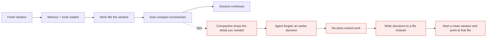

# CLAUDE.md and context engineering

*Module 04*

The difference between an agent that guesses your conventions every session and one that already knows them is a single file - plus the discipline to keep the context window clean.

[Course home](../index.md) / Module 04

## 1. The problem CLAUDE.md solves

Ask a fresh session "what is this project about" and it will crawl your directories, read your README, run a few commands and eventually answer. That cost you tokens, time, and a chunk of your context window - and tomorrow it will do the whole thing again.

**CLAUDE.md is a file that gets loaded into context automatically at the start of every conversation in that project.** It is where you put the guidance you would otherwise repeat every single session.

**Session start, with and without a memory file**



> **Why it matters:** Write down anything you have had to correct twice. The second correction is the signal that it belongs in a memory file.

## 2. Generate the first version

Do not write it from a blank page. Inside a session:

```text
/init
```

Claude reads the project and drafts a CLAUDE.md - stack, layout, build and test commands, conventions it can infer. Review it, delete the filler, and add what only a human knows. That last part is the whole value.

## 3. The memory hierarchy

| File | Scope | Commit it? | Use for |
| --- | --- | --- | --- |
| `./CLAUDE.md` | This project, whole team | **Yes** | Architecture, commands, conventions, do-not-touch rules. |
| `./CLAUDE.local.md` | This project, only you | **No** - gitignore it | Your local paths, personal shortcuts, your own preferences. |
| `~/.claude/CLAUDE.md` | Every project on this machine | n/a | How you like to work: response style, language preferences, universal rules. |
| `subdir/CLAUDE.md` | That subtree | Yes | Rules for one service or package in a monorepo. |

All applicable files layer together, most specific winning. You can also pull in other files by reference so one CLAUDE.md stays short:

```text
# Project memory
See @docs/architecture.md for the service map.
See @docs/testing.md for the test strategy.
```

> **NOTE - Quick capture**
>
> Mid-session, prefix a line with `#` to append it to memory without leaving the conversation, and use `/memory` to open the files for editing. Capture the rule at the moment you discover it - you will not remember it later.

## 4. What to put in it (and what to keep out)

| Put in | Keep out |
| --- | --- |
| Exact build, test, lint and run commands | Secrets, keys, tokens, customer data - it is committed and it is read every session |
| Directory map and what each area owns | A copy of your README - link to it instead |
| Conventions: naming, error handling, logging, commit format | Long tutorials the model already knows |
| Landmines: "never edit generated/", "migrations are hand-written" | Anything that changes weekly - it will rot |
| Definition of done: tests pass, lint clean, changelog updated | Vague vibes: "write good code" |

```text
# CLAUDE.md

## Stack
Python 3.12, FastAPI, Postgres, pytest. Package manager: uv.

## Commands
- install: `uv sync`
- test:    `uv run pytest -q`         <-- always run before claiming done
- lint:    `uv run ruff check . --fix`
- serve:   `uv run uvicorn app.main:app --reload`

## Layout
- `app/api/`      route handlers, thin - no business logic here
- `app/services/` business logic, unit tested
- `app/models/`   SQLAlchemy models; migrations in `alembic/` are hand-written

## Rules
- Never edit files under `app/generated/`.
- New endpoints need a test in `tests/api/` in the same PR.
- Errors: raise domain exceptions, map to HTTP in one place (`app/api/errors.py`).
- Do not add a dependency without asking.

## Definition of done
Tests green, ruff clean, and a one-line entry in CHANGELOG.md.
```

> **TIP - Keep it short and testable**
>
> Aim for something a new hire could read in two minutes. Every line should be either a fact, a command, or a rule with a clear violation. Rules that cannot be violated are decoration, and decoration costs tokens every session.

## 5. Reading the context window

Run `/context` and you get the breakdown - system prompt, tools, memory files, skills, messages, and the buffer reserved for auto-compaction. This is the single most useful diagnostic in Claude Code.

| What you see | What it means |
| --- | --- |
| Memory taking a large share | Your CLAUDE.md has grown into a document. Split it and use @imports. |
| Tools taking a large share | Too many MCP servers or plugins loaded. Turn off what this project does not use. |
| Messages dominating | Long session. `/compact` or, better, `/clear` and restate the task. |
| Free space nearly gone | Quality is about to drop. Act before it does. |

**Context lifecycle in a long session**



> **Why it matters:** Compaction is lossy by definition - it is a summary. Anything that must survive should live in a file on disk, not in the conversation.

## 6. Context engineering habits

- **Fresh session per task.** The cheapest quality improvement available.
- **Write plans to disk.** Ask for `PLAN.md`, then execute against it. The plan survives compaction, a chat message does not.
- **Reference files, do not paste them.** The agent can read `app/services/billing.py` itself; a paste is permanent context.
- **Delegate the noisy work.** A search across 400 files belongs in a sub-agent whose context you never see (module 06).
- **Progressive disclosure.** Load detailed instructions only when a task needs them - that is exactly what Skills do (module 09).
- **Prune your tools.** Every connected MCP server spends context on its schemas before you type anything.
- **A big window is not a plan.** Quality degrades well before the limit; treat the window as a budget you actively manage.

> **WARNING - Instruction decay is real**
>
> Long sessions drift away from rules stated at the top. If a convention keeps getting violated late in a session, that is not disobedience - it is distance. Restate it, or restart, or move the rule into CLAUDE.md where it is reloaded every time.

> **PRACTICE - Practice now**
>
> 1. Run `/init` in a real project. Read the generated file critically and cut it in half.
> 2. Add the three rules you personally always have to explain to a new team member.
> 3. Run `/context` before and after. Note the memory line.
> 4. Create `~/.claude/CLAUDE.md` with your personal working preferences. Confirm it applies in a different project.
> 5. Have a long session, run `/compact`, then ask about something decided early. Observe what survived.

> **ASSIGNMENT - Assignment**
>
> Write a CLAUDE.md for your main repo, then prove it works: in a brand new session ask for a change that depends on a convention you documented. If the agent follows it without being told, the file earns its place. If not, the line was too vague - rewrite it as a command or a hard rule and try again.

## 7. Interview drill

<details>
<summary><b>Where do project, personal and global instructions each belong, and why?</b></summary>

Project CLAUDE.md is committed so the whole team gets the same behaviour. CLAUDE.local.md is gitignored for machine-specific or personal preferences. The global file under the user's home applies to every project on that machine. Splitting them prevents personal preferences leaking into the team's shared standard.

</details>

<details>
<summary><b>The agent keeps ignoring a rule late in long sessions. Diagnosis?</b></summary>

Context pressure and instruction decay, not defiance. Move the rule to CLAUDE.md so it reloads every session, shorten sessions, and where possible enforce it mechanically with a hook or a lint rule rather than a sentence.

</details>

<details>
<summary><b>Why is a 1M-token context window not a substitute for context engineering?</b></summary>

Cost scales with what you put in it, latency rises, and retrieval quality falls as the window fills with irrelevant material. A large window buys you headroom for genuinely large inputs; it does not make sloppy context free.

</details>

<details>
<summary><b>What must never go into CLAUDE.md?</b></summary>

Secrets and credentials - it is committed to the repo and loaded into every conversation. Also anything volatile enough to be wrong in a month, because a stale rule is worse than no rule.

</details>

---

[← Module 03](03-claude-code-fundamentals.md) &nbsp;&nbsp;|&nbsp;&nbsp; [Module 05: Modes, permissions, tools →](05-modes-permissions-tools.md)

---

Claude AI: Zero to Architect · Himanshu Kumar.
