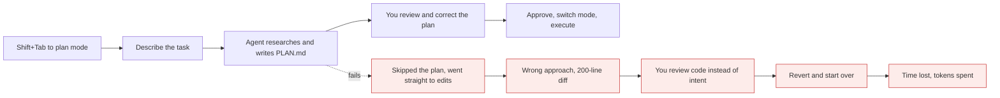
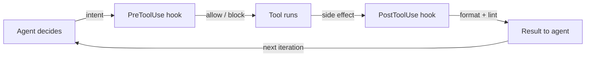
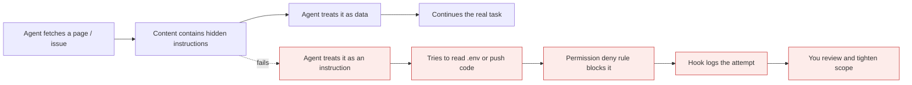

# Modes, permissions, tools and hooks

*Module 05*

This is the module that decides whether an agent is useful or dangerous. Everything here is about controlling what it may do, proving what it did, and keeping a human at the points that matter.

[Course home](../index.md) / Module 05

## 1. Modes: Shift+Tab

Cycling `Shift+Tab` changes how much the agent may do without asking. Same model, very different risk.

| Mode | Behaviour | Use it when |
| --- | --- | --- |
| **Normal** | Asks before each write or command | Default. Unfamiliar code, anything shared. |
| **Plan mode** | Read and research only - produces a plan, changes nothing | Any non-trivial task. Cheapest way to catch a wrong approach. |
| **Accept edits** | Applies file edits without prompting, still asks for commands | A tight loop you are actively watching, on a branch. |
| **Full auto** | Minimal prompting | Sandboxes and disposable containers only. |

**Plan first, then execute**



> **Why it matters:** Reviewing a plan takes thirty seconds. Reviewing the diff of a wrong plan takes twenty minutes and you will miss things.

> **WARNING - The flag that ends careers**
>
> There is a "skip all permissions" flag. It exists for disposable containers with no credentials and no network access to anything you care about. Using it on a laptop with SSH keys, cloud credentials and production access is how a bad afternoon becomes an incident report.

## 2. The tool inventory

Ask a session `what tools do you have` and it will list them. Broadly:

| Group | Tools | Risk |
| --- | --- | --- |
| Read | Read, Glob, Grep, NotebookRead | Low - but it reads secrets too |
| Write | Write, Edit, NotebookEdit | Medium - reviewable as a diff |
| Execute | Bash / shell | **High** - arbitrary commands with your privileges |
| Network | WebFetch, WebSearch | Medium - pulls untrusted text into context |
| Delegate | Task / sub-agents (module 06) | Inherits whatever tools you grant |
| External | MCP server tools (module 10) | As risky as the server you connected |

## 3. Permission rules in settings.json

Clicking "allow" fifty times a day trains you to stop reading the prompts. Encode the decision once instead.

| File | Scope | Commit? |
| --- | --- | --- |
| `.claude/settings.json` | Project, shared with the team | Yes |
| `.claude/settings.local.json` | Project, just you | No - gitignored |
| `~/.claude/settings.json` | All your projects | n/a |

```json
{
  "permissions": {
    "allow": [
      "Bash(npm run test:*)",
      "Bash(git status)",
      "Bash(git diff:*)",
      "Read(./src/**)"
    ],
    "ask": [
      "Bash(git push:*)"
    ],
    "deny": [
      "Bash(rm -rf:*)",
      "Bash(curl:*)",
      "Read(./.env)",
      "Read(./secrets/**)"
    ]
  },
  "env": {
    "NODE_ENV": "development"
  }
}
```

> **TIP - Design principle**
>
> Allow the boring loop - tests, lint, build, git status, reading source. Ask for anything that leaves your machine. Deny anything that destroys, exfiltrates, or reads secrets. Then the approval prompts you do see are meaningful, and you will actually read them.

## 4. Hooks: make rules deterministic

A rule in CLAUDE.md is a request. A hook is a guarantee - a shell command the harness runs at a defined point in the lifecycle, whose exit code can block the action.

| Event | Fires | Typical use |
| --- | --- | --- |
| `PreToolUse` | Before a tool runs | Block writes to protected paths; non-zero exit stops it. |
| `PostToolUse` | After a tool runs | Auto-format and lint every file that was edited. |
| `UserPromptSubmit` | When you submit a prompt | Inject standing context, or reject prompts by policy. |
| `Stop` / `SubagentStop` | When a turn or sub-agent finishes | Run the test suite before it declares success. |
| `SessionStart` / `SessionEnd` | Session boundaries | Load environment state; write an audit record. |
| `PreCompact` | Before compaction | Persist decisions to disk before the summary loses them. |

```json
{
  "hooks": {
    "PostToolUse": [
      {
        "matcher": "Edit|Write",
        "hooks": [
          { "type": "command", "command": "ruff format $CLAUDE_FILE_PATHS && ruff check --fix $CLAUDE_FILE_PATHS" }
        ]
      }
    ]
  }
}
```

**Where a hook sits in the loop**



> **Why it matters:** Hooks are deterministic code, not instructions. If a policy must always hold, a hook enforces it; a sentence in a prompt only suggests it.

## 5. Custom slash commands

Any prompt you type more than twice should be a file. Drop a markdown file in `.claude/commands/` and it becomes `/name`.

```markdown
<!-- .claude/commands/review.md -->
---
description: Review the staged diff like a senior engineer
allowed-tools: Bash(git diff:*), Read
---

Review the staged changes for: $ARGUMENTS

Checklist:
1. Correctness and edge cases
2. Security - injection, authz, secrets in code
3. Tests - is the new behaviour covered?
4. Naming and consistency with our conventions

Output: a numbered list, worst issue first. No praise, no summary paragraph.
```

Then `/review payment flow` runs it with `$ARGUMENTS` substituted. Project commands live in the repo and are shared; personal ones live in `~/.claude/commands/`.

## 6. Prompt injection is now a code problem

Your agent reads issue text, web pages, dependency READMEs and log output. Any of those can contain instructions aimed at the agent. It is not hypothetical - it is the main attack surface of agentic coding.

**Injection attempt through fetched content**



> **Why it matters:** Defence is layered: deny rules on secrets and network commands, hooks that block, review of every diff, and never running an agent with credentials it does not need for the task.

- **Least privilege per project.** A docs repo agent does not need shell access to your cloud CLI.
- **Deny reads of secret paths** even in trusted repos - the agent cannot leak what it cannot read.
- **Review the diff, not the summary.** The summary is written by the thing you are checking.
- **Treat autonomy as a spectrum** tied to blast radius: read-only anywhere, edits on a branch, commands in a container, deploys never without a human.

> **PRACTICE - Practice now**
>
> 1. Create `.claude/settings.json` with allow rules for your test and lint commands and deny rules for `.env` and destructive shell commands.
> 2. Verify the deny rule: ask the agent to read `.env` and confirm it is blocked.
> 3. Add a PostToolUse hook that formats every edited file. Make one edit and watch it fire.
> 4. Write a `/review` command and run it on a real staged diff.
> 5. Do one task fully in plan mode, save the plan to a file, then execute it in a second session.

> **ASSIGNMENT - Assignment**
>
> Write a one-page "agent safety policy" for your team: which modes are allowed on which repos, the standard allow / ask / deny lists, the mandatory hooks, and who reviews agent-authored PRs. Commit it next to CLAUDE.md. This is a genuinely strong artifact to bring to an architecture interview.

## 7. Interview drill

<details>
<summary><b>Rule in CLAUDE.md versus a hook - when do you choose which?</b></summary>

CLAUDE.md for guidance the model should apply with judgement. A hook for anything that must always hold - formatting, protected paths, tests before completion. Instructions are probabilistic; hooks are deterministic. Compliance requirements belong in hooks.

</details>

<details>
<summary><b>How do you defend an agent that reads GitHub issues from prompt injection?</b></summary>

Layers: treat fetched content as data in the prompt structure, deny access to secrets and outbound network commands, restrict tools to what the task needs, require human review on any diff, and log tool use so an attempt is visible. No single control is sufficient.

</details>

<details>
<summary><b>Your team clicks "allow" reflexively. What is the fix?</b></summary>

Reduce the number of prompts so the remaining ones carry signal: allow-list the safe repetitive commands, deny-list the dangerous ones, and leave "ask" only for genuinely consequential actions like pushing or deploying.

</details>

<details>
<summary><b>When is full autonomy acceptable?</b></summary>

When the blast radius is bounded: an ephemeral container, no production credentials, no network egress to sensitive systems, and output that lands as a reviewable pull request rather than a deployment.

</details>

---

[← Module 04](04-claude-md-context.md) &nbsp;&nbsp;|&nbsp;&nbsp; [Module 06: Sub-agents →](06-subagents.md)

---

Claude AI: Zero to Architect · Himanshu Kumar. Settings schema and hook events evolve - check the official docs.
