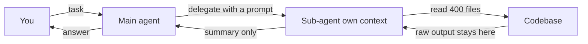
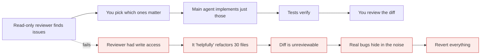

# Sub-agents

*Module 06*

A sub-agent is a separate Claude instance with its own context window, its own tool set, and one job. It does the noisy work and hands back a summary - so your main conversation stays clean.

[Course home](../index.md) / Module 06

## 1. The one idea

Searching 400 files to answer one question can dump enormous output into your session. A sub-agent reads all of it in **its own** context, then returns a 200-word answer. You pay for the search once and your main window never sees the noise.

**Delegation and what comes back**



> **Why it matters:** The sub-agent cannot see your conversation. It only gets the prompt you hand it - so that prompt must be self-contained.

|  | Main agent | Sub-agent |
| --- | --- | --- |
| Context | Your whole conversation | Fresh window, only its prompt |
| Sees your chat? | - | **No** |
| Returns | - | One final summary message |
| Tools | Everything allowed | Only what you grant it |
| Lifetime | The session | One task, then gone |

## 2. Built-in agents

Some already exist and get used automatically:

- **Explore** - searches and maps a codebase without polluting your context.
- **Plan** - what runs behind plan mode; produces a plan as an isolated instance.
- **General purpose** - multi-step tasks that need several tools.
- **Claude Code guide** - answers questions about Claude Code itself.
- **Status line setup** - configures your terminal status line.

Run `/agents` to see the library, what is running, and to create new ones.

## 3. Create one, the guided way

`/agents` then "create new agent" walks you through six decisions. Each one matters:

| Decision | Options | How to choose |
| --- | --- | --- |
| **Location** | Project (`.claude/agents/`) or personal (`~/.claude/agents/`) | Project if the team benefits and you want it in git. Personal for your own habits. |
| **Description** | Free text, generated into a prompt | Be specific about *what* and *when*. This text is how the main agent decides to invoke it. |
| **Tools** | All / read-only / edit / execution / MCP | **Read-only unless it genuinely must write.** A reviewer that can edit will "helpfully" rewrite your code. |
| **Model** | Deep / balanced / fast / inherit | Match the job. Bulk scanning on the fast tier, architectural judgement on the deep tier. |
| **Memory scope** | Project / user / local | Project so findings are shared and reviewable. |
| **Colour** | Cosmetic | Genuinely useful once three agents are running at once. |

> **TIP - Do not guess which agents you need**
>
> Ask in the repo: *"based on this project, which sub-agents would give the most value, and why?"* The answer is grounded in your actual structure - test coverage gaps, review bottlenecks, docs that go stale - instead of a generic list.

## 4. The file format

An agent is just a markdown file with frontmatter. You can write it by hand or edit what the wizard generated:

```markdown
<!-- .claude/agents/code-improvement-advisor.md -->
---
name: code-improvement-advisor
description: Use when the user asks for a code review, refactoring suggestions,
  readability or performance improvements. Reports findings; never edits files.
tools: Read, Glob, Grep
model: sonnet
---

You are a senior code improvement advisor.

## Scope
Analyse only files inside this repository. Never modify anything.

## Method
1. Map the structure before judging any single file.
2. For each finding report: file and line, severity (high/medium/low),
   the current code, why it is a problem, and an improved version.
3. Prefer three high-value findings over twenty trivial ones.

## Output
Group by severity, worst first. If nothing is wrong, say so - do not invent work.

## Never
- Do not comment on formatting handled by the linter.
- Do not suggest rewrites of generated code.
```

> **WARNING - The description field is the router**
>
> The main agent picks a sub-agent by reading its description. "Reviews code" competes with everything. "Use when the user asks for readability, performance or best-practice review of existing files; read-only" gets invoked at the right time and only then.

## 5. Running it

```text
> review the whole project and give me improvement suggestions
# main agent matches the description and delegates automatically

> use the code-improvement-advisor on app/services/
# or invoke it explicitly
```

Findings come back as a single summary. Because the agent is read-only, nothing changed - you decide what to action. That separation of **advice** from **edits** is the pattern worth internalising.

**Review-then-fix, safely**



> **Why it matters:** Separating who finds problems from who fixes them keeps every diff small enough to actually review.

## 6. When NOT to use a sub-agent

| Situation | Do this instead |
| --- | --- |
| You know the file path | Just read it. Spawning an agent is pure overhead. |
| One-line lookup | Grep it. |
| Task needs your conversation history | Keep it in the main agent - the sub-agent cannot see the chat. |
| Sub-agents need to talk to each other | That is agent teams (module 08). Sub-agents cannot coordinate. |

#### Extra points

- **Parallelism.** Several sub-agents can run concurrently - great for "review these four modules", terrible for your token budget if you do it thoughtlessly.
- **Self-contained prompts.** No chat history means the delegating prompt must carry every constraint.
- **Version them in git.** A well-tuned agent file is team IP; review changes to it like code.
- **Start from the pain.** The agents worth building are the reviews you keep doing manually.
- **They cost real tokens.** Each one has its own window and its own system prompt. Delegate to save context, not to look sophisticated.

> **PRACTICE - Practice now**
>
> 1. Run `/agents` and read the built-in list.
> 2. Ask the repo which sub-agents it would benefit from.
> 3. Create a read-only **code improvement advisor** at project scope with only Read, Glob and Grep.
> 4. Open `.claude/agents/` and read the generated file. Tighten the description and delete filler from the prompt.
> 5. Run it on a real directory, then check `/context` - confirm your main window stayed small.
> 6. Build a second one: a **test-gap finder** that lists untested public functions, worst first.

> **ASSIGNMENT - Assignment**
>
> Ship three project-scoped sub-agents to your repo: a read-only reviewer, a test-gap finder, and a documentation checker that flags stale docs against current code. Commit them, then have a teammate run one without any explanation from you. If they get useful output first try, your description and prompt are good.

## 7. Interview drill

<details>
<summary><b>Why does a sub-agent save context if it uses the same model?</b></summary>

Because the raw output stays in the sub-agent's window. Your main window receives only the final summary, so a search over hundreds of files costs you a paragraph instead of thousands of tokens.

</details>

<details>
<summary><b>Why give a reviewer read-only tools?</b></summary>

To separate analysis from mutation. A reviewer that can write turns a review into an unreviewable refactor, and you lose the ability to choose which findings to act on. It also bounds the blast radius if the prompt is manipulated.

</details>

<details>
<summary><b>A sub-agent produced an answer that ignored something discussed earlier in the chat. Why?</b></summary>

It never saw the chat. Sub-agents only receive the prompt handed to them, so any constraint from earlier in the conversation must be restated in the delegation.

</details>

<details>
<summary><b>When is a sub-agent the wrong tool?</b></summary>

Single-file lookups where you already know the path, tasks that depend on conversation history, and anything requiring two workers to coordinate mid-task - that last one needs agent teams.

</details>

---

[← Module 05](05-modes-permissions-tools.md) &nbsp;&nbsp;|&nbsp;&nbsp; [Module 07: Agent views →](07-agent-views.md)

---

Claude AI: Zero to Architect · Himanshu Kumar.
