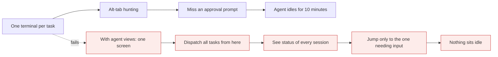

# Agent views

*Module 07*

Four terminals, four half-finished tasks, and you cannot remember which one is waiting on you. Agent views turn that mess into one dashboard: what is running, what needs you, what is done.

[Course home](../index.md) / Module 07

## 1. The problem

Agentic work is bursty. You give a task, it runs for two minutes, then it needs an approval. Meanwhile you could have started three more. So people open more terminals - and lose track of all of them.

**Before and after**



> **Why it matters:** The bottleneck in agentic work is not model speed - it is you being the approval queue. A single view removes almost all of that wait.

## 2. Open it

```bash
claude agents
```

You get every session in one list with its state:

| State | Means | Your move |
| --- | --- | --- |
| **Working** | Running autonomously | Leave it. Start another task. |
| **Needs input** | Blocked on a permission or a question | Open it, answer, come straight back. |
| **Completed** | Finished | Open, read the result, review the diff. |

Arrow keys move between sessions, Enter opens one, and `/bg` sends you back to the background view from inside any session. Those three keys are the entire workflow.

## 3. A realistic run

```bash
claude agents

# dispatch, without waiting for any of them:
> update README.md with a section on agent views
> check the unit tests in tests/test_example.py and report gaps
> run the code-improvement-advisor agent on app/services/
> find every TODO older than six months and list them by file
```

Now watch the board. Answer the one that turns amber, then go back. Four tasks progress at once and the only serial part is your attention.

> **TIP - It runs your sub-agents too**
>
> Anything from module 06 can be dispatched here. A reviewer, a test-gap finder and a docs checker can all run against the same repo simultaneously while you keep working in your editor.

## 4. What to dispatch in parallel - and what not to

| Good in parallel | Keep serial |
| --- | --- |
| Read-only analysis across different areas | Two tasks editing the same files |
| Docs, changelog, README updates | Anything that runs a migration |
| Independent test suites | Steps where task B needs task A's output |
| Reviews of separate modules | Sequential git operations on one branch |

> **WARNING - Parallel agents can collide**
>
> Two sessions editing the same file will overwrite each other, and two running the same test suite can fight over ports and fixtures. Give write-heavy tasks their own branch or git worktree. Parallelism is only free when the tasks are genuinely independent.

#### Extra points

- **Token cost is additive.** Four sessions cost roughly four sessions. Parallel is faster, not cheaper.
- **Write clearer prompts.** You will not be watching each one, so ambiguity gets discovered late.
- **Ask for a written artifact.** "Save findings to `reports/tests.md`" beats a summary you have to re-read in a terminal buffer.
- **Batch approvals.** Sensible allow-rules (module 05) mean far fewer sessions sitting in "needs input".
- **Review is still serial.** Four agents can produce four diffs in ten minutes; you still have to read them. Parallelism moves the bottleneck to review - plan for that.

> **PRACTICE - Practice now**
>
> 1. Run `claude agents` in a repo.
> 2. Dispatch three independent tasks - a docs update, a test review, and a read-only agent run.
> 3. Use `/bg` to move between them. Answer only the one that needs input.
> 4. Time it against doing the same three tasks one after another.
> 5. Now deliberately dispatch two tasks that edit the same file and observe the collision. Then redo it with a worktree.

> **ASSIGNMENT - Assignment**
>
> Define your personal "morning board": three tasks you dispatch every day before you start coding - for example dependency check, test-gap report, and stale-docs report, each writing to a file under `reports/`. Run it for a week and note how many issues you found before they became tickets.

## 5. Interview drill

<details>
<summary><b>What problem do agent views solve that sub-agents do not?</b></summary>

Sub-agents parallelise work *inside* one session. Agent views parallelise *sessions* and give you a single control surface for dispatching, monitoring and answering them. One is an execution primitive, the other is an operator interface.

</details>

<details>
<summary><b>You parallelise four tasks and throughput barely improves. Why?</b></summary>

Either the tasks were not independent - they queued on the same files or the same test resources - or you became the bottleneck answering approvals and reviewing diffs. Fix the first with worktrees, the second with permission rules.

</details>

<details>
<summary><b>Does running four agents cost four times as much?</b></summary>

Roughly, yes - each has its own context and its own tokens. Parallelism buys wall-clock time, not efficiency. Justify it when time matters, and use cheaper model tiers for the shallow tasks.

</details>

---

[← Module 06](06-subagents.md) &nbsp;&nbsp;|&nbsp;&nbsp; [Module 08: Agent teams →](08-agent-teams.md)

---

Claude AI: Zero to Architect · Himanshu Kumar. Agent views are evolving fast - confirm commands in the current docs.
