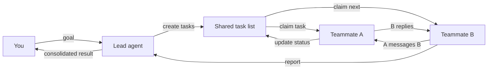
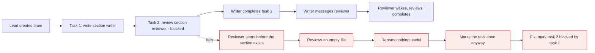

# Agent teams

*Module 08 · Experimental*

Sub-agents are fire and forget: spawn, run once, return, vanish. Agent teams are persistent teammates that stay alive across turns, share a task list, and message each other mid-task.

[Course home](../index.md) / Module 08

## 1. Two shapes of parallel work

|  | Sub-agents (hierarchy) | Agent teams (collaboration) |
| --- | --- | --- |
| Structure | Lead delegates down, results merge back | Lead plus named teammates working a shared list |
| Lifetime | One task, then gone | Persist across multiple turns |
| Context | Own window, isolated | Own window plus shared task state |
| Communication | Only with the lead | Teammate to teammate, directly |
| Coordination | None - they cannot see each other | Claim tasks, signal blockers, hand off |
| Best for | Focused, independent tasks | Complex work with dependencies between parts |
| Token cost | Higher than one agent | **Highest** - coordination messages are tokens too |

**Collaborative structure**



> **Why it matters:** The shared task list is the coordination substrate. Without it two agents duplicate work; with it they can see what is claimed, what is blocked and what is done.

## 2. Turn it on

Agent teams are experimental and gated behind a flag in your settings:

```text
// .claude/settings.json
{
  "env": {
    "CLAUDE_CODE_EXPERIMENTAL_AGENT_TEAMS": "1"
  }
}
```

> **WARNING - Experimental means experimental**
>
> The flag name, the tools and the behaviour can change between releases. Do not build a team workflow into a production pipeline yet - use it for exploratory work and verify the current flag in the docs before you assume anything here still holds.

## 3. The primitives

| Capability | What it does |
| --- | --- |
| Create team | Establishes the team and the shared workspace. |
| Spawn teammate (named) | Adds a persistent agent with a role - "middleware reviewer", "docs writer". |
| Create task | Adds an item to the shared list, visible to everyone. |
| Update task | Claim, mark in progress, blocked, or complete. |
| Send message | Direct teammate-to-teammate communication mid-task. |
| Shut down | Ends the team cleanly once tasks are complete. |

## 4. A real run

```text
> Create a small team to review two notebooks in parallel: one teammate on the
  middleware notebook, one on the RAG notebook. Use the shared task list, and
  report consolidated findings back to me when both are done.
```

The lead creates the team, spawns two named teammates, populates the task list, and each teammate claims its task. They mark progress on the shared list and message the lead - or each other - when they hit a dependency. When both are complete the lead consolidates and shuts the team down.

**Writer and reviewer, with a real dependency**



> **Why it matters:** Dependencies must be explicit in the task list. Idle-until-unblocked is correct behaviour; a teammate that reviews nothing and declares success is the failure you actually need to catch.

## 5. When a team is worth it

| Use a team | Use sub-agents instead |
| --- | --- |
| Work with real dependencies between parts | Fully independent tasks |
| Producer / reviewer, or writer / verifier pairs | One-shot analysis or search |
| Long tasks where roles persist over many turns | Anything that finishes in one call |
| You want visibility into who is doing what | You only care about the final answer |

> **TIP - Honest guidance**
>
> Most problems do not need a team. Reach for a single agent first, then sub-agents, then a team - and only when coordination is the actual bottleneck. Each step up multiplies cost and adds a new failure mode: agents talking to each other about work instead of doing it.

#### Extra points

- **Cost grows super-linearly.** Every coordination message is input tokens for the receiver. Budget before you run a five-teammate team.
- **Give roles, not tasks.** "You own test coverage for the API layer" produces better teammates than "run pytest".
- **Define done per task.** Ambiguity that one agent would ask you about becomes an assumption a teammate acts on.
- **Watch for consensus drift.** Agents can agree with each other and be wrong together. A reviewer needs explicit instructions to disagree.
- **Always shut the team down.** Idle teammates are idle spend.
- **Keep humans on the merge.** A consolidated report authored by the same system that did the work is not an independent review.

> **PRACTICE - Practice now**
>
> 1. Enable the experimental flag in `.claude/settings.json`.
> 2. Ask a session to explain agent teams in your repo, then to demo one with two teammates.
> 3. Run a writer + reviewer team to add a documentation section, with the review task blocked by the write task.
> 4. Watch the reviewer stay idle until unblocked - that is correct behaviour, not a bug.
> 5. Compare the token usage against doing the same job with two sub-agents.

> **ASSIGNMENT - Assignment**
>
> Take one genuinely dependent workflow - for example "migrate a module, then update its tests, then update the docs" - and implement it twice: once as sequential single-agent work, once as a team. Record wall-clock time, token spend, and quality of the result. Write a short recommendation on when your team should reach for a team. Being able to say "we measured it" is what separates an architect from an enthusiast.

## 6. Interview drill

<details>
<summary><b>Sub-agents versus agent teams in one sentence each.</b></summary>

Sub-agents: isolated, fire-and-forget workers that return a summary to the lead. Agent teams: persistent teammates that share a task list and can message each other, for work where the parts depend on each other.

</details>

<details>
<summary><b>Why do teams cost more than the sum of their work?</b></summary>

Coordination is not free. Every message one teammate sends is input tokens for another, plus each teammate carries its own system prompt and context. You pay for the conversation as well as the work.

</details>

<details>
<summary><b>What is the characteristic failure mode of a multi-agent setup?</b></summary>

Agents agreeing with each other and progressing confidently in the wrong direction, plus tasks marked complete that were never really done. Mitigate with explicit definitions of done, a reviewer instructed to disagree, and a human at the merge point.

</details>

<details>
<summary><b>Would you put an agent team in a production pipeline today?</b></summary>

No - it is experimental, the interface can change, and cost is hard to bound. Use it for exploratory and internal work; for production automation prefer a deterministic pipeline that calls single agents at defined steps.

</details>

---

[← Module 07](07-agent-views.md) &nbsp;&nbsp;|&nbsp;&nbsp; [Module 09: Skills →](09-skills.md)

---

Claude AI: Zero to Architect · Himanshu Kumar. Experimental feature - verify flags and tool names against current docs.
