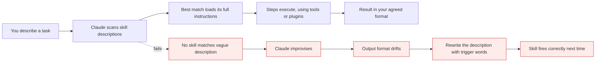
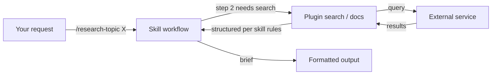

# Skills

*Module 09*

A skill is a reusable, versioned folder of instructions, resources and examples that teaches Claude how to do a specific kind of task - loaded only when that task actually comes up.

[Course home](../index.md) / Module 09

## 1. What a skill is for

You have a workflow you repeat: research a topic and produce a structured brief; audit a component against your design system; turn a bug report into a reproducible test. Every time, you explain the steps again.

Put those steps in a file once. Claude reads the skill's short description all the time, and loads the full instructions only when a request matches. That is **progressive disclosure** - and it is why skills scale where a giant system prompt does not.

**How a skill gets used**



> **Why it matters:** The description field is the whole routing mechanism. A brilliant skill with a vague description will never run.

## 2. Where skills live

| Path | Scope | Commit? |
| --- | --- | --- |
| `.claude/skills/<name>/SKILL.md` | This project, whole team | Yes |
| `~/.claude/skills/<name>/SKILL.md` | Every project on your machine | n/a |
| Bundled inside a plugin | Anyone who installs the plugin | Ships with the plugin (module 10) |

A skill is a **folder**, not just a file - which means it can carry templates, scripts, examples and reference documents next to its instructions.

## 3. Create one

Fastest route is to ask for it in plain language:

```text
> Create a skill called research-topic. It should research a topic and return a
  structured brief. It should use web search, and the Exa plugin when available.
  Write SKILL.md into this project so the team gets it.
```

Then open the generated file and tighten it. Anatomy:

```markdown
<!-- .claude/skills/research-topic/SKILL.md -->
---
name: research-topic
description: Research a technical topic and return a structured brief with
  key points, trade-offs and cited sources. Use when the user asks to research,
  investigate, compare or summarise a topic or technology.
allowed-tools: WebSearch, WebFetch, Read, Write
---

# Research topic

## Input
A topic string. If it is ambiguous, ask exactly one clarifying question first.

## Steps
1. Search for primary sources - official docs and specs before blog posts.
2. If the Exa plugin is available, use it for deep search; otherwise use web search.
3. Cross-check any claim that appears in only one source.
4. Note publication dates. Flag anything older than 12 months as possibly stale.

## Output format
- **Topic** - one-line definition
- **Why it exists** - the problem it solves
- **Key points** - 5 to 8 bullets
- **Trade-offs** - what it costs you
- **When not to use it**
- **Sources** - title + URL + date

## Rules
- Never state a version number or price without a source.
- If sources conflict, show both and say so. Do not average them.
```

> **TIP - Write the description for the router, the body for the worker**
>
> Description: what the task is and the words a user would actually say ("research", "investigate", "compare"). Body: the steps, the output contract, and the rules. Two different audiences, two different styles.

## 4. Invoke it

```text
/research-topic what are LLM gateways

# or just describe the task and let the description route it:
> research LLM gateways for me
```

Output arrives in the format the skill defined - every time, by every person on the team. That consistency is the real product. Anyone can get an answer; a skill makes the answer *the same shape* for everyone.

## 5. Skill versus sub-agent versus slash command

|  | Slash command | Skill | Sub-agent |
| --- | --- | --- | --- |
| Is | A saved prompt | A packaged workflow with resources | A separate instance with its own context |
| Triggered by | You typing `/name` | You, or automatically by description match | Delegation from the main agent |
| Own context? | No | No - runs in the current session | **Yes** |
| Carries files? | No | **Yes** - templates, scripts, examples | No |
| Pick it when | You repeat a prompt | You repeat a multi-step procedure | You need isolation or parallelism |

They compose: a slash command can invoke a skill, and a skill's steps can be delegated to a sub-agent.

## 6. Skills that use plugins

A skill is a workflow; a plugin brings capability. Combine them and a skill stops being limited to what the model already knows.

**Skill calling a plugin**



> **Why it matters:** Skill = the procedure and the output contract. Plugin = the capability. Keep them separate so you can swap the search provider without rewriting the workflow.

> **WARNING - Always write a fallback**
>
> A plugin can be missing, unauthenticated or rate limited. If your skill says "use Exa" with no alternative, it fails outright the first time the key expires. Write it as: prefer Exa, fall back to web search, and say in the output which one was used.

#### Extra points

- **Keep SKILL.md short.** Push detail into referenced files in the same folder; that is what progressive disclosure is for.
- **Version them in git** and review changes - a skill silently altering its output format breaks everyone downstream.
- **Scope tools per skill.** A formatting skill does not need shell access.
- **Skills are cross-surface.** The same packaging idea shows up in the apps and in Cowork, not just in Claude Code.
- **Test a skill like code:** run it on three inputs including an ambiguous one, and check it asks rather than assumes.
- **Name for the task, not the tech.**`research-topic` ages better than `exa-search`.

> **PRACTICE - Practice now**
>
> 1. Build the `research-topic` skill at project scope and run it on a real question.
> 2. Open the generated SKILL.md, tighten the description with trigger words, and add an explicit output contract.
> 3. Build a second skill: `open-source-docs` that fetches current library documentation and returns working example code.
> 4. Test routing: describe a task in natural language without the slash command and confirm the right skill fires.
> 5. Break it on purpose - remove the plugin - and confirm your fallback path works.

> **ASSIGNMENT - Assignment**
>
> Package the workflow you personally repeat most often as a skill: a PR review checklist, an incident write-up template, a data-quality audit, whatever it is. It must include an output contract and a rule for ambiguous input. Commit it, then get a teammate to use it with no explanation. If their output looks like yours, the skill works.

## 7. Interview drill

<details>
<summary><b>Why is a skill better than putting the same instructions in the system prompt?</b></summary>

Progressive disclosure. Only the short description is always in context; the full instructions load when relevant. That lets you have fifty skills without paying for fifty sets of instructions on every request - and it keeps unrelated guidance from biasing other tasks.

</details>

<details>
<summary><b>Your skill never triggers automatically. Fix it.</b></summary>

The description is the router. Rewrite it to state the task plus the phrases a user would actually use, keep it distinct from other skills, and test by describing the task naturally rather than invoking it by name.

</details>

<details>
<summary><b>Skill or sub-agent?</b></summary>

Skill when you need a repeatable procedure and a consistent output format in the current conversation. Sub-agent when you need context isolation, a restricted tool set, or parallel execution. They compose - a skill can delegate a heavy step to a sub-agent.

</details>

<details>
<summary><b>How do you keep a library of skills from rotting?</b></summary>

Treat them as code: version control, review, an owner per skill, and a periodic run against known inputs to verify the output contract still holds. Delete skills nobody invokes - dead skills still cost description tokens and confuse routing.

</details>

---

[← Module 08](08-agent-teams.md) &nbsp;&nbsp;|&nbsp;&nbsp; [Module 10: Plugins & MCP →](10-plugins-mcp.md)

---

Claude AI: Zero to Architect · Himanshu Kumar.
