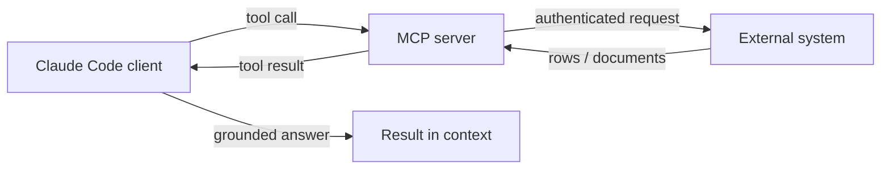
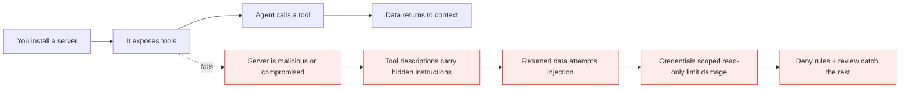

# Plugins, marketplaces and MCP

*Module 10*

Skills teach Claude a procedure. Plugins and MCP servers give it capability - live documentation, deep search, your ticketing system, your database. This is where the agent stops guessing and starts knowing.

[Course home](../index.md) / Module 10

## 1. Plugin, MCP server, skill - what is what

| Thing | Is | Gives you |
| --- | --- | --- |
| **Skill** | Instructions in a folder | A repeatable procedure and output contract |
| **MCP server** | A process exposing tools over a standard protocol | Access to a system - database, API, service |
| **Plugin** | A distributable bundle | Any mix of commands, skills, sub-agents, hooks and MCP servers, installed in one step |

Think of MCP as the port and the plugin as the packaged device you plug into it.

## 2. Installing plugins

```text
/plugin                      # browse, install, enable, disable
/plugin marketplace add <marketplace>
/plugin install <name>@<marketplace>
```

Useful categories you will actually reach for:

- **Live documentation** - pulls current library docs into context so generated code matches the version you are on, not the version in the training data.
- **Deep web search** - better retrieval than a plain search for research tasks.
- **Browser automation** - drive a real browser for UI checks and scraping.
- **Issue trackers and version control** - read tickets, open PRs, comment.

> **TIP - Reload after installing**
>
> New plugin tools are picked up when the plugin set reloads. If the agent says a tool "is not callable yet", reload plugins or restart the session before you start debugging anything else.

> **WARNING - Authentication is a separate step**
>
> Installing a plugin does not authenticate it. Many need an API key or a one-time login, and until then the tool exists but fails. This is the single most common "why isn't it working" moment - and the reason your skills need a fallback path.

## 3. MCP in one diagram

**How an MCP tool call travels**



> **Why it matters:** The MCP server holds the credentials, not the model. That boundary is what makes the pattern safe enough to use with internal systems.

| Concept | Meaning |
| --- | --- |
| **Client** | Claude Code (or another host) that consumes the tools. |
| **Server** | A process exposing tools, resources and prompts. |
| **Transport** | `stdio` for local processes; HTTP/SSE for remote servers. |
| **Tools** | Actions the model can call - `query_orders`, `create_ticket`. |
| **Resources** | Readable content the client can pull in - files, records, docs. |
| **Prompts** | Reusable prompt templates the server offers. |

## 4. Connecting a server

```bash
claude mcp add my-db -- npx -y @some/mcp-server --readonly
claude mcp list
/mcp                     # inspect and authenticate servers from inside a session
```

For a project everyone shares, commit a `.mcp.json` at the repo root so teammates get the same servers:

```json
{
  "mcpServers": {
    "reporting-db": {
      "command": "npx",
      "args": ["-y", "@some/mcp-server", "--readonly"],
      "env": { "DB_URL": "${REPORTING_DB_URL}" }
    }
  }
}
```

> **WARNING - Never commit the credential, only the reference**
>
> Use an environment variable placeholder. A connection string in `.mcp.json` is a connection string in your git history, forever.

## 5. Building your own server

Worth doing once, because it makes the whole protocol click. A minimal Python server exposing one tool:

```python
from mcp.server.fastmcp import FastMCP

mcp = FastMCP("orders")

@mcp.tool()
def order_status(order_id: str) -> str:
    """Return the current status of an order. Use for questions about a specific order."""
    if not order_id.isalnum():          # validate at the boundary, always
        raise ValueError("invalid order id")
    row = db.fetch_one("SELECT status FROM orders WHERE id = %s", (order_id,))
    return row["status"] if row else "not found"

if __name__ == "__main__":
    mcp.run()
```

Three things decide whether it is any good:

- **The docstring.** It is the tool description the model routes on. Vague docstring, wrong tool choice.
- **The parameters.** Narrow, typed, validated. Never accept raw SQL from the model.
- **The return shape.** Small and structured. Returning 5,000 rows floods the context and helps nobody.

## 6. The security model

**Threat path through a third-party server**



> **Why it matters:** An MCP server is a dependency with runtime access to your systems. Review it like one: who publishes it, what permissions it needs, and what it can reach if it turns hostile.

- **Read-only credentials by default.** Most useful servers only need to read.
- **One server, one purpose.** Narrow servers are easier to audit and cheaper in context.
- **Pin versions.** Auto-updating a tool that can touch your database is not a feature.
- **Treat tool output as untrusted text.** It can contain injection attempts (module 05).
- **Prune what you connect.** Every server's schemas sit in your context window before you type a word - check with `/context`.

> **PRACTICE - Practice now**
>
> 1. Run `/plugin`, browse a marketplace, and install a live-documentation plugin.
> 2. Authenticate it, reload, and ask a version-specific coding question. Compare the answer with and without it.
> 3. Install a deep-search plugin and wire it into your `research-topic` skill from module 09 - with a fallback.
> 4. Run `/context` before and after installing three plugins. Note the tools line.
> 5. Build the minimal MCP server above against a local SQLite file and connect it with `claude mcp add`.

> **ASSIGNMENT - Assignment**
>
> Build an MCP server that exposes one genuinely useful read-only tool from a system your team uses - a reporting view, a status endpoint, an internal wiki search. Write the docstring carefully, validate inputs, cap the result size, and document required environment variables in the README. Then write a two-paragraph threat model: what it can reach, and what happens if the model is manipulated into calling it badly.

## 7. Interview drill

<details>
<summary><b>Why does MCP exist when every vendor could ship its own integration?</b></summary>

To stop the M x N integration problem. One protocol means any compliant client can use any compliant server, so a tool you build for one host works across the ecosystem instead of being rewritten per product.

</details>

<details>
<summary><b>Plugin, skill or MCP server - a colleague wants "Claude to read our Jira".</b></summary>

MCP server for the capability - it holds the credentials and exposes tools. A skill on top if there is a repeatable procedure such as triage. A plugin if you want to distribute both to the whole team in one install.

</details>

<details>
<summary><b>What makes an MCP tool well designed?</b></summary>

A precise docstring the model can route on, narrow validated typed parameters, no raw query passthrough, and a small structured response. Bad tools fail by being too general and returning too much.

</details>

<details>
<summary><b>Biggest risk of connecting third-party MCP servers?</b></summary>

You are granting a dependency live access to your systems, and its tool descriptions and outputs enter your model's context - so both supply chain and prompt injection apply. Mitigate with read-only credentials, pinned versions, narrow scope, and review of anything that writes.

</details>

---

[← Module 09](09-skills.md) &nbsp;&nbsp;|&nbsp;&nbsp; [Module 11: Cowork & Projects →](11-cowork-projects-artifacts.md)

---

Claude AI: Zero to Architect · Himanshu Kumar. Plugin and MCP commands evolve - confirm against current docs.
