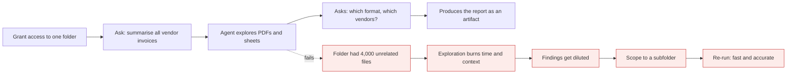
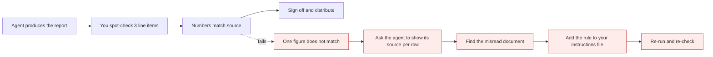

# Cowork, Projects and Artifacts

*Module 11*

The same agentic loop, pointed at documents instead of source code. This is the module for the invoices, spreadsheets, reports and reviews that eat a manager's month - and it needs no programming at all.

[Course home](../index.md) / Module 11

## 1. Cowork: an agent for a folder

Give the desktop app access to one folder and describe the outcome you want. It explores the files, plans, asks clarifying questions, uses tools, and produces real output - a report, a spreadsheet, a summary document.

**A month-end reporting run**

> **Why it matters:** Folder scope is the single biggest quality control you have. One agent, one folder, one job.

| Good Cowork jobs | Not Cowork jobs |
| --- | --- |
| Summarise a folder of invoices into one report | Refactor a codebase (that is Claude Code) |
| Reconcile a spreadsheet against source documents | Anything needing a live production system |
| Turn meeting notes into a decision log | Work where a mistake ships to customers unreviewed |
| Draft a monthly status pack from raw data | Legally binding output with no human sign-off |

> **WARNING - Say what you actually want before it starts**
>
> "Analyse this folder" gets you a wall of text. "List every vendor invoice with number, date, vendor and amount, as a markdown table sorted by amount, and flag any duplicates" gets you something you can use. Specify the output format, the fields and the sort order up front - not after the third attempt.

## 2. Connectors and skills here too

Cowork can attach connectors (external systems) and use skills, exactly like Claude Code. The same principle applies: a skill packages the procedure and the output contract so next month's report looks identical to this month's, whoever runs it.

> **TIP - The non-developer's version of CLAUDE.md**
>
> Keep a plain instruction file in the working folder - naming conventions, what a valid invoice looks like, the exact report format, who signs off. Ask the agent to read it first. You get the same consistency benefit without touching a terminal.

## 3. Projects: reusable context

A Project is a workspace with its own knowledge and instructions attached. Everything you chat about inside it starts with that context already loaded.

| Put in a Project | Why |
| --- | --- |
| Standards, templates, style guides | Output matches house style without being asked |
| Domain glossary | Stops the model guessing what your internal terms mean |
| Reference documents people keep re-pasting | Paste once, use forever |
| Custom instructions for the role | "You are our RFP reviewer" beats re-explaining every chat |

> **WARNING - A Project is shared context, so treat it like a shared drive**
>
> Anything you upload is visible to everyone with access and is loaded into conversations. No credentials, no unredacted personal data, and check your organisation's policy before uploading client material.

## 4. Artifacts: output you can inspect

Artifacts are the generated documents, tables, dashboards and small apps that appear alongside the conversation rather than buried inside it. Two reasons they matter:

- **Reviewability.** A report you can open, scroll and check beats a wall of chat text.
- **Iteration.** "Same report, but group by quarter" edits the artifact instead of regenerating everything.

## 5. Human in the loop, for non-developers

Everything from module 05 applies here in plain language:

| Rule | In practice |
| --- | --- |
| Scope the folder | Copy the files you need into a working folder. Never point it at your whole drive. |
| Approve, do not rubber-stamp | Read what it is about to do. The prompt is the checkpoint. |
| Spot-check the numbers | Verify three rows against the source documents. Every time, not just the first time. |
| Keep the source of truth | The agent produces a draft. Your system of record stays your system of record. |
| Know what left the room | Understand what your plan does with uploaded data before you upload client files. |

**Trust, but verify - the review loop**

> **Why it matters:** Ask for citations per row - which file and page each number came from. Verification becomes seconds instead of an afternoon.

> **PRACTICE - Practice now**
>
> 1. Create a scoped folder with 10 to 20 sample documents.
> 2. Run one vague prompt and one precise prompt with an explicit output format. Compare.
> 3. Add an instructions file to the folder and re-run - see how much less you have to explain.
> 4. Ask for the output as a table with a source reference per row, then verify three rows by hand.
> 5. Set up a Project with your team's templates and glossary; run the same task inside it.

> **ASSIGNMENT - Assignment**
>
> Take a recurring manual task from your own month - a status pack, a reconciliation, a review - and reduce it to: a scoped folder, an instructions file, one precise prompt, and a verification checklist. Run it once manually and once with the agent, and record the time difference and any errors caught. That before/after is the most convincing thing you can show a sceptical manager.

## 6. Interview drill

<b>A non-technical team wants to adopt this. What do you set up first?</b>

Scoped working folders, a written instructions file per workflow, a required verification step, and a clear rule about what data may be uploaded. Tooling second; guardrails first - the failure mode is confidently wrong output going out unchecked.

<b>Cowork or Claude Code for "clean up 200 CSV files and produce a summary"?</b>

Cowork if it is a one-off owned by a non-developer. Claude Code if it should become a repeatable script in version control - the deliverable there is the pipeline, not the summary.

<b>How do you make agent output auditable?</b>

Require per-row source references, keep the artifact alongside the inputs, record which instruction file version produced it, and keep a human sign-off step. Auditability is a process requirement, not a model feature.

---

[← Module 10](10-plugins-mcp.md) &nbsp;&nbsp;|&nbsp;&nbsp; [Module 12: Evals, cost & architecture →](12-evals-cost-architecture.md)

---

Claude AI: Zero to Architect · Himanshu Kumar.
