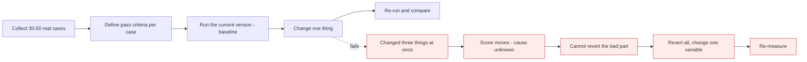
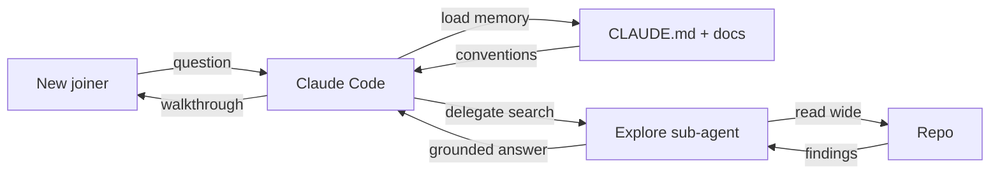

# Evals, cost, safety & architecture

*Module 12 · Capstone*

The module that decides whether anything you built in modules 01 to 11 is allowed near production - and the interview bank that proves you can defend it.

[Course home](../index.md) / Module 12

## 1. Evaluation: no demo without a test

Prompts, skills and agent configurations are code with no compiler. The only way to know a change helped is to measure it against fixed cases.

**The eval loop**

> **Why it matters:** A 'vibes' regression test is the same as no regression test. Thirty real cases with explicit pass criteria beats a thousand synthetic ones.

| Method | Good for | Watch out |
| --- | --- | --- |
| **Exact / rule check** | Extraction, classification, JSON shape, required fields | Only works when there is one right answer |
| **Golden set + human review** | Anything subjective, small volumes | Expensive; keep the set small and real |
| **LLM as judge** | Scaling subjective scoring | Judges are biased toward verbosity and their own style. Calibrate against human labels before trusting it. |
| **Task success rate** | Agents - did the test suite go green? | The most honest agent metric there is: measure the outcome, not the prose |

> **TIP - Build the eval set from failures**
>
> Every time the agent gets something wrong, that case becomes a permanent test. After a month your eval set is an exact map of your system's weak points - and it is impossible to reintroduce an old bug quietly.

## 2. Cost and latency

| Lever | Typical effect | Cost of using it |
| --- | --- | --- |
| Route by difficulty (fast tier first) | Largest single saving | Needs the router evaluated too |
| Prompt caching on a stable prefix | Cheap re-reads of long context | Cache writes cost more; prefix must be byte-identical and reused within the TTL |
| Batch processing | Roughly half price | Not interactive |
| Trim / summarise history | Stops quadratic growth | Lossy - persist decisions to files |
| Semantic cache on repeat questions | Repeats become free | Staleness and near-miss matches |
| Shorter output contracts | Output tokens cost multiples of input | None. Do this first. |

> **WARNING - Agent cost is not chat cost**
>
> One agent turn can be dozens of model calls - read, plan, edit, test, re-read. Budget per *task completed*, not per message, and put a hard cap on steps, tokens and wall-clock time in any autonomous loop. An agent without a budget is an open-ended invoice.

## 3. Safety checklist before production

- **Least privilege** - allow / ask / deny rules per project; no credentials the task does not need.
- **Untrusted text is data** - delimited, never treated as instructions. Applies to issues, web pages, tool output and dependency files.
- **Deterministic gates** - hooks and CI checks for anything that must always hold.
- **Human on irreversible actions** - deploys, deletes, payments, external communication.
- **Full audit trail** - prompt version, model, tools called, tokens, latency, outcome.
- **Kill switch** - one flag that stops all autonomous runs, tested before you need it.
- **Data boundaries** - know what leaves your network and redact what does not need to.

## 4. Case study A - the onboarding assistant

**Problem:** new joiners burn two weeks and a lot of senior time getting oriented.

**Onboarding assistant**

> **Why it matters:** The valuable artifact is not the chat - it is the CLAUDE.md the team maintains. The assistant is just the interface to it.

**Design:** committed CLAUDE.md with architecture, commands and landmines; an Explore sub-agent so wide searches never pollute context; read-only permissions by default. **Measure:** time to first merged PR, and the number of questions escalated to a senior.

## 5. Case study B - the automated reviewer

**Problem:** review latency blocks the team; trivial issues consume senior attention.

**Design:** a read-only reviewer sub-agent with a strict output contract (severity, file, line, why, suggested fix), invoked headlessly in CI via `claude -p` on the PR diff, posting one structured comment. Hooks run format and lint first so the reviewer never spends attention on style. Humans still approve; the bot never merges.

**Failure mode to design for:** noise. A reviewer that posts 40 comments gets muted in a week. Cap it at the five highest-severity findings and measure the percentage of comments that get acted on - that ratio is the real quality metric.

## 6. Case study C - the internal ops agent

**Problem:** support keeps asking engineers to run read-only queries.

**Design:** an MCP server exposing three narrow, validated, read-only tools (no raw SQL); a skill defining the triage procedure and output format; deny rules on everything else; every call logged with the requesting user.

**Why it is safe enough:** credentials live in the server, not the model; the tool surface is three functions, not a database; and results are capped in size. **Measure:** engineer interrupts per week, and query error rate.

## 7. Staff-level interview bank

<b>Walk me through how you would introduce Claude Code to a 30-person engineering org.</b>

Pilot with one team on a real repo. Ship CLAUDE.md and a shared settings.json with allow/ask/deny lists and formatting hooks. Add two or three sub-agents that address that team's actual bottleneck. Measure cycle time and review latency against a baseline. Write the safety policy before expanding, then roll out team by team with the artifacts, not just the licences. Tooling spreads easily; conventions do not.

<b>How do you stop agent-generated code from degrading quality?</b>

Same controls as human code plus two: an eval set for the prompts and agents themselves, and hooks that make formatting, linting and tests non-negotiable. Every change still lands as a reviewed PR. The failure mode is volume - more diffs than the team can review - so cap parallelism at review capacity.

<b>Single agent, sub-agents, or a team - how do you decide?</b>

Start single. Add sub-agents when context pollution or parallel independent work is the bottleneck. Use a team only when the parts genuinely depend on each other and coordination is the problem. Each step multiplies cost and adds failure modes, so the burden of proof rises with each one.

<b>Your agent costs tripled after a feature launch. How do you investigate?</b>

Read the logs: tokens per completed task, split input/output/cache-read, by feature. Usually one of - history growing unbounded, cache misses from a prefix that now varies, a deep-tier model on shallow work, or a retry loop firing repeatedly. Fix the biggest contributor, re-run the eval to confirm quality held, then set a hard budget per task so it cannot happen silently again.

<b>How do you evaluate an agent, as opposed to a single prompt?</b>

Outcome-based: did the task actually complete - tests green, ticket resolved, file correct? Plus trajectory metrics: steps taken, tools called, retries, cost per success. A prompt is graded on its answer; an agent is graded on the end state of the world.

<b>Convince a sceptical security lead that this is safe to adopt.</b>

Do not argue capability - present controls. Scoped permissions per project, deny lists on secrets and destructive commands, deterministic hooks, no production credentials, everything landing as a reviewed PR, full audit logging, and a tested kill switch. Then propose a bounded pilot on a non-sensitive repo with an agreed review date. Security leads say yes to bounded risk, not to enthusiasm.

<b>What is the most common architectural mistake you see?</b>

Reaching for autonomy before building verification. Teams add agents, parallelism and multi-agent orchestration while still having no eval set and no automated definition of done. The order should be inverted: make success measurable, then add autonomy up to the level your verification can actually catch.

> **ASSIGNMENT - Capstone**
>
> Pick one real workflow at your job and ship it end to end: CLAUDE.md, permission rules, at least one hook, one sub-agent, one skill, and one plugin or MCP server. Then write a one-page design doc with an architecture diagram, the eval set and baseline scores, the cost per completed task, the failure modes and their mitigations, and the measured before/after. That document is simultaneously your portfolio piece and your interview script.

---

[← Module 11](11-cowork-projects-artifacts.md) &nbsp;&nbsp;|&nbsp;&nbsp; [Module 13: AI Fluency →](13-ai-fluency-4d.md)

---

Claude AI: Zero to Architect · Himanshu Kumar. End of course - now go build something and measure it.
