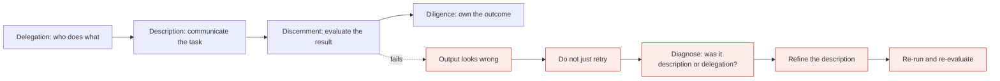

# AI Fluency: the 4D framework

*Module 13 · Track A*

Delegation, Description, Discernment, Diligence. Four competencies that survive every model release, because they describe what *you* do - not which button the vendor shipped this quarter.

[Course home](../index.md) / Module 13

> **NOTE - Source**
>
> This module follows the AI Fluency framework developed by Rick Dakan (Ringling College) and Joseph Feller (University College Cork), taught in Anthropic's *AI Fluency: Framework & Foundations*. The framing is theirs; the engineering commentary and the drills are mine.

## 1. What AI fluency actually means

Four adverbs, and they are not decoration:

| Word | Question it answers |
| --- | --- |
| **Effectively** | Did you get the outcome you wanted? |
| **Efficiently** | Was it worth the time, tokens and attention it cost? |
| **Ethically** | Was it honest about authorship, sources and consent? |
| **Safely** | Did it avoid harm - to data, to people, to your organisation? |

Most "prompt tips" content only addresses the first. The other three are what makes the difference between a personal trick and something an organisation can adopt.

## 2. Three ways to engage

| Mode | Who does the work | Example | Main risk |
| --- | --- | --- | --- |
| **Automation** | AI executes a defined task you specified | "Convert these 200 files to JSON" | Silent failure at scale |
| **Augmentation** | You and AI work together, back and forth | Drafting a design doc together | Anchoring on the first draft |
| **Agency** | AI pursues a goal with its own sub-decisions | An agent fixing a failing test suite | Unbounded actions, unclear accountability |

**The 4D loop**



> **Why it matters:** Retrying the same prompt hoping for a better roll is the single most common waste in AI work. Every failed output is information about which D was weak.

## 3. D1 - Delegation

Deciding what to hand over, to which system, and how much autonomy to grant. Three sub-skills:

- **Problem awareness** - what is the actual goal, what does success look like, what constraints are real?
- **Platform awareness** - what is this particular system good and bad at? A model with no web access cannot know today's price.
- **Task delegation** - split the work: which parts are AI's, which are yours, which are shared.

> **TIP - Engineer's version**
>
> Delegation is architecture. "Should the model do this, or should deterministic code do this?" is the same question as "should this be an agent or a workflow". If the task has one right answer and a rule can produce it, do not hand it to a probabilistic system.

## 4. D2 - Description

Communicating what you want. Three layers, and most people only use the first:

| Layer | You specify | Example |
| --- | --- | --- |
| **Product** | What the output should be | "A one-page brief, 5 bullets, no preamble" |
| **Process** | How to get there | "First list assumptions, then evaluate each against the data" |
| **Performance** | What role and manner to adopt | "Act as a sceptical reviewer; challenge weak claims" |

Foundational techniques that raise description quality: give context and audience, state constraints explicitly, show an example of a good answer, ask for the format you actually need, and say what to do when uncertain ("if the data does not support a conclusion, say so").

## 5. D3 - Discernment

Critical evaluation, in three places:

- **Product discernment** - is the output correct, complete, well-sourced, appropriately confident?
- **Process discernment** - was the reasoning sound, or did it reach the right answer for the wrong reason?
- **Performance discernment** - is the behaviour drifting - agreeing with you too readily, padding length, hedging everything?

> **WARNING - Fluency is calibrated trust, not maximum trust or zero trust**
>
> Trusting everything produces confident errors in your work. Trusting nothing means you check every line by hand and gain nothing. The skill is knowing which parts of a given task sit where on that spectrum - which is exactly what module 14 gives you a model for.

## 6. D4 - Diligence

| Type | Means | In practice |
| --- | --- | --- |
| **Creation diligence** | Responsible choices while producing | Verify facts, respect sources and licences, do not feed confidential data into systems not cleared for it. |
| **Transparency diligence** | Honest disclosure of AI involvement | Say what was AI-assisted and how. An AI diligence statement is the formal version. |
| **Deployment diligence** | Owning the consequences | You are accountable for what you ship. "The model wrote it" is not a defence in a review, an audit, or a court. |

```text
AI diligence statement - template

Tools used:      Claude (model tier, approximate date range)
Where used:      research synthesis, first-draft structure, code review of module X
Where not used:  the analysis and conclusions; all figures verified against source data
Human review:    every claim checked against a primary source; author accepts responsibility
                 for accuracy and for all final decisions.
```

## 7. Applying the 4Ds to agents

Everything in modules 03 to 12 is the 4Ds with tooling attached:

| D | In Claude Code terms |
| --- | --- |
| Delegation | Permission modes, sub-agent scoping, choosing workflow vs agent |
| Description | CLAUDE.md, skills, output contracts, plan mode |
| Discernment | Reviewing diffs, evals, test-based verification |
| Diligence | Hooks, audit logs, human sign-off, disclosure of AI-authored code |

> **PRACTICE - Practice now**
>
> 1. Take a task you did with AI this week. Name which D was weakest and rewrite that part.
> 2. Rewrite one prompt to include all three description layers - product, process, performance.
> 3. Classify three of your recent tasks as automation, augmentation or agency. Was each one the right choice?
> 4. Write an AI diligence statement for something you actually shipped.
> 5. Take one bad output and diagnose it: description failure, delegation failure, or a model limitation?

> **ASSIGNMENT - Assignment**
>
> Write your team's one-page AI collaboration standard using the 4Ds as headings: what may be delegated and to what autonomy level, the required description elements for a shared prompt, the review bar per risk tier, and the disclosure rule. This is the document a manager can actually adopt - far more useful than a prompt library.

## 8. Interview drill

<details>
<summary><b>Explain the 4D framework and why it is model-agnostic.</b></summary>

Delegation, Description, Discernment, Diligence - deciding what to hand over, communicating it, evaluating the result, and owning the outcome. It describes human competencies rather than product features, so it survives model and vendor changes. Prompt tricks expire; these do not.

</details>

<details>
<summary><b>Automation, augmentation, agency - which is riskiest and why?</b></summary>

Agency, because the system makes sub-decisions you never explicitly approved, so the failure surface is the whole action space rather than one output. That is why agency needs bounded permissions, verification and a human on irreversible steps.

</details>

<details>
<summary><b>A junior keeps retrying prompts until something looks right. What are you teaching them?</b></summary>

The Description-Discernment loop. Every unsatisfactory output is diagnostic information: unclear description, wrong delegation, or a genuine model limitation. Identify which, then fix that specific thing. Re-rolling optimises for output that looks convincing, not output that is correct.

</details>

---

[← Module 12](12-evals-cost-architecture.md) &nbsp;&nbsp;|&nbsp;&nbsp; [Module 14: Capabilities & limitations →](14-ai-capabilities-limits.md)

---

Claude AI: Zero to Architect · Himanshu Kumar. Framework credit: Rick Dakan & Joseph Feller, via Anthropic's AI Fluency course.
