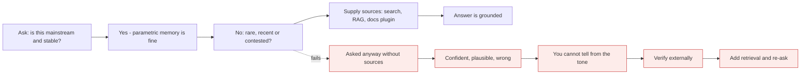
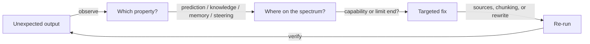

# Capabilities and limitations

*Module 14 · Track A*

Four properties explain almost every surprising thing a model does. Learn them and "why did it do that?" becomes a diagnosis instead of a shrug.

[Course home](../index.md) / Module 14

## 1. Where the behaviour comes from

Two training stages leave visible fingerprints:

| Stage | What it does | What it leaves behind |
| --- | --- | --- |
| **Pretraining** | Learns to predict the next token over a huge corpus | Broad knowledge, fluent style, and the training cutoff |
| **Fine-tuning / alignment** | Shapes it into a helpful, harmless assistant | Sycophancy, verbosity, over-caution, and loose confidence calibration |

> **NOTE - Name the fingerprints, because you will see them daily**
>
> **Sycophancy** - agreeing with your framing rather than pushing back. **Verbosity** - length as a proxy for helpfulness. **Over-caution** - hedging on things it actually knows. **Calibration** - the same confident tone whether it is certain or guessing.

## 2. Property 1 - Next-token prediction

Every answer is built one token at a time by predicting what plausibly comes next. That single fact explains both the strengths and the failure mode.

| Strong (well-worn paths) | Weak (fabrication concentrates here) |
| --- | --- |
| Summarising, reformatting, translating, drafting | Exact citations, IDs, page numbers, version numbers |
| Common code patterns and idioms | Rare APIs, private internal systems |
| Style transfer and rewriting | Precise arithmetic done "in the head" |

**Fix:** give it the source, or give it a tool. A citation should come from a retrieved document; arithmetic should come from code execution. Do not ask prediction to do the job of a lookup.

## 3. Property 2 - Knowledge

A model knows what appeared in training data *frequently, recently and consistently*. Place your question on that spectrum before you trust the answer.

**Judging whether the model can know this**

> **Why it matters:** Confidence in the reply carries no information about whether the model knows. Tone is style; grounding is architecture.

## 4. Property 3 - Working memory

The context window is everything the model can attend to right now. Nothing else exists - not the last session, not the file you did not include.

- **Attention is not uniform.** Material at the very start and very end of a long context gets more weight than the middle. Put critical instructions where they will be seen.
- **Long does not mean absorbed.** A document fitting in the window is not the same as every sentence being used.
- **Sessions are stateless.** A fresh conversation remembers nothing. Memory is a file you maintain (module 04).
- **Placement strategies:** front-load the instruction, chunk large inputs, and re-supply critical constraints near the end of a long prompt.

## 5. Property 4 - Steerability

How much control your instructions really give you. Not all instructions land equally:

| Steers reliably | Steers loosely |
| --- | --- |
| "Respond as a markdown table" | "Be insightful" |
| "Under 100 words" | "Reason carefully about all the edge cases" (across a long chain) |
| "Return only valid JSON matching this schema" | "Be exactly 500 words" - native precision is weak |
| "If unsure, say 'insufficient data'" | Abstract stylistic goals with no verifiable test |

Two named failures worth recognising: **reasoning drift** - the instruction holds for three steps then fades; and **letter over spirit** - it obeys the words of your instruction while missing the intent.

> **TIP - The rewrite rule**
>
> Turn every wobbly instruction into something a script could check. "Make it clear" is unverifiable. "Maximum 12 words per bullet, no adjectives, one claim per bullet" is checkable - and therefore steerable.

## 6. When properties collide

Real tasks never test one property at a time. A 90-page contract review strains working memory *and* reaches past knowledge. A vague creative brief tests steerability exactly where prediction wants to fill in something plausible.

**Diagnostic for any unexpected output**

> **Why it matters:** Generic retry is the anti-pattern. Name the property, place the task on its spectrum, apply the matching fix.

| Symptom | Property | Fix |
| --- | --- | --- |
| Invented citation or API method | Prediction + knowledge | Retrieval, docs plugin, or "cite only from the supplied text" |
| Forgot a rule stated earlier | Working memory | Re-supply near the end; shorten the session; move it to CLAUDE.md |
| Agreed with a wrong premise | Steerability (sycophancy) | Ask for the counter-argument; instruct it to challenge assumptions |
| Ignored a formatting instruction late in a long answer | Steerability drift | Shorter output, schema enforcement, or a tool with a typed result |
| Confidently wrong on a niche topic | Knowledge | Ground it, or accept it cannot know and route elsewhere |

> **WARNING - Hallucination is not a bug you can prompt away**
>
> It is the same mechanism that makes the model useful, operating where the data was thin. You reduce it with grounding, tools, verification and explicit permission to say "I don't know" - not by adding "do not hallucinate" to your prompt.

> **PRACTICE - Practice now**
>
> 1. Ask about something genuinely obscure in your domain. Note how confident the wrong answer sounds.
> 2. Repeat with the source document supplied. Compare.
> 3. Put a critical rule at the very start of a long prompt, then at the end. Observe which is followed.
> 4. Give a deliberately wrong premise and see whether it pushes back. Then add "challenge my assumptions" and retry.
> 5. Take three failures from your own week and label each with a property and a targeted fix.

> **ASSIGNMENT - Assignment**
>
> Build a one-page diagnostic card for your team: symptom on the left, property in the middle, fix on the right, with real examples from your own domain. Pin it where people run prompts. It converts frustration into a repeatable debugging procedure.

## 7. Interview drill

<b>Why does a model produce a confident, fabricated citation?</b>

Next-token prediction generating what a citation *looks like* in a region where training data was sparse. The fix is architectural - retrieval or a tool that returns real references - not a stronger instruction.

<b>Your instruction is followed at the start of a long answer and dropped later.</b>

Reasoning drift under context pressure. Shorten the output, re-supply the constraint late in the prompt, or enforce it structurally with a schema or tool rather than prose.

<b>How do you decide whether a task needs RAG?</b>

Place it on the knowledge spectrum: is the information mainstream, stable and well represented, or rare, recent, private or contested? The second category needs grounding. Volatility and privacy, not difficulty, are the deciding factors.

<b>What is calibrated trust and how do you teach it?</b>

Matching your verification effort to where the task sits on each property's spectrum. Teach it with the diagnostic: name the property, locate the task, verify proportionally. Blanket trust and blanket distrust are both failures of calibration.

---

[← Module 13](13-ai-fluency-4d.md) &nbsp;&nbsp;|&nbsp;&nbsp; [Module 15: Claude 101 in practice →](15-claude-101-everyday.md)

---

Claude AI: Zero to Architect · Himanshu Kumar. Four-property framing follows Anthropic's AI Capabilities and Limitations course.
