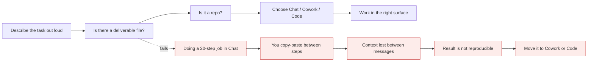

# Claude 101 in practice

*Module 15 · Track A*

The everyday layer: how to have a first conversation that is actually useful, which of the three shapes of work a task calls for, and the features that turn ad-hoc chatting into a repeatable working system.

[Course home](../index.md) / Module 15

## 1. The three shapes of work

Inside the desktop app there are three fundamentally different modes, and picking the wrong one is the most common beginner mistake.

| Shape | Surface | You are doing | Signal it is the right one |
| --- | --- | --- | --- |
| **Turn by turn** | Chat | Thinking, drafting, deciding together | You want to see and shape each step |
| **Handing work off** | Cowork | Delegating a multi-step job over real files | You want a deliverable, not a conversation |
| **Building software** | Claude Code | Reading and changing a codebase | The artifact is a repository |

**Picking the shape**



> **Why it matters:** If you find yourself acting as the clipboard between the model and your files, you are in the wrong surface.

## 2. A first conversation that is worth having

Beginner prompt: "help me with my report." Better, using the description layers from module 13:

```text
Context:   I run monthly ops reporting for a 40-person team.
Task:      Turn the attached raw numbers into an exec summary.
Audience:  Directors - they care about trend and risk, not method.
Format:    5 bullets max, one line each, lead with the number.
Constraint: Only use figures present in the data. If something is missing,
            list it under "Data gaps" rather than estimating.
```

Then **refine rather than re-roll**: "Bullet 3 buries the trend - lead with the percentage change." Each correction is a description improvement you can reuse next month.

## 3. Projects: standing context

A Project is a workspace with knowledge and instructions attached, so every conversation inside it starts already briefed.

| Put in | Effect |
| --- | --- |
| Custom instructions for the role | Consistent voice and behaviour without re-explaining |
| Templates and style guides | Output matches house format by default |
| Glossary of internal terms | Stops confident misreadings of your jargon |
| Stable reference documents | Paste once instead of every conversation |

> **WARNING - A Project is shared context**
>
> Anything uploaded is visible to everyone with access and enters every conversation there. No credentials, no unredacted personal data, and check policy before uploading client material.

## 4. Artifacts

Generated documents, tables, dashboards and small apps that appear beside the conversation instead of buried inside it. Two reasons they matter: you can **review** them properly, and you can **iterate** on them ("same table, grouped by quarter") without regenerating everything.

## 5. Skills, at the everyday level

Same idea as module 09, no coding required: package a recurring procedure - your weekly report, your RFP review, your meeting-notes-to-decisions conversion - so the steps and the output format are identical every time and anyone on the team can run it.

> **TIP - The test for whether something should be a skill**
>
> Have you explained the same procedure three times? Then it is a skill. Explaining it a fourth time is a choice.

## 6. Connectors, Enterprise Search and Research

| Feature | Brings in | Watch for |
| --- | --- | --- |
| **Connectors** | Your tools and data sources | Grant the narrowest scope that works; review what each one can read |
| **Enterprise Search** | Your organisation's internal knowledge | Permissions must mirror existing access - it should never widen who can see what |
| **Research** | Multi-step web investigation with sources | Slower and costlier; check the citations, do not just trust the summary |

## 7. Claude where you already work

- **In Chrome** - context from the page you are on, and driving web apps directly.
- **In Microsoft 365** - working inside Word, Excel, PowerPoint and Outlook rather than exporting to chat.
- **Desktop app** - Chat, Cowork and Code in one place.
- **Mobile** - capture and review; not where you do multi-step work.

The principle: every time you copy content out of a tool to paste into a chat window, you have found a place where an integration belongs.

## 8. Role-based starting points

| Role | First workflow that pays for itself |
| --- | --- |
| Engineer | Codebase walkthrough, then agent-assisted review (modules 03-06) |
| Analyst | Folder of source documents to a structured, cited summary (module 11) |
| Manager / lead | Status pack assembly and meeting notes to decision log |
| Consultant / architect | Requirement notes to a first-draft design doc you then attack |
| Support | Triage drafts grounded in your actual knowledge base, never invented |

> **PRACTICE - Practice now**
>
> 1. Rewrite your most-used prompt with context, task, audience, format and constraints.
> 2. Create a Project for one recurring responsibility and load your template and glossary into it.
> 3. Run the same task inside and outside the Project. Compare the amount of correcting you do.
> 4. Convert your most-repeated procedure into a skill.
> 5. List every place this week you copy-pasted between a tool and a chat window - that list is your integration backlog.

> **ASSIGNMENT - Assignment**
>
> Pick your single most repetitive weekly task and build the full setup: a Project with standing context, a skill with an output contract, and a verification step. Run it three weeks in a row and record time saved and errors caught. That measured before/after is what convinces a team - a demo never does.

## 9. Interview drill

<details>
<summary><b>How do you explain Chat vs Cowork vs Code to a non-technical team?</b></summary>

Chat is a conversation, Cowork is handing over a job with real files, Code is changing software. Pick by asking what the deliverable is: a decision, a document, or a repository.

</details>

<details>
<summary><b>Someone's outputs are inconsistent week to week. What do you change?</b></summary>

Move the standing context into a Project and the procedure into a skill with an explicit output contract. The inconsistency comes from re-describing the task differently each time, not from the model.

</details>

<details>
<summary><b>What is the governance risk with connectors and enterprise search?</b></summary>

Permission widening. Retrieval must respect the same access controls as the underlying systems, or you have built a way to read documents people were never entitled to see. Verify scope before rollout, not after.

</details>

---

[← Module 14](14-ai-capabilities-limits.md) &nbsp;&nbsp;|&nbsp;&nbsp; [Module 16: Prompt engineering →](16-prompt-engineering.md)

---

Claude AI: Zero to Architect · Himanshu Kumar. Feature set follows Anthropic's Claude 101 course; availability varies by plan.
