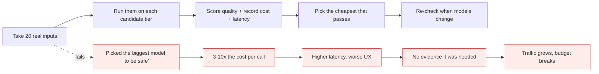
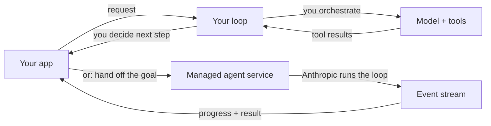

# The Claude Platform

*Module 17 · Track C*

The gap between chatting in a browser tab and shipping something is not prompting - it is the loop, the tools, the context budget and the spend controls. This module closes it.

[Course home](../index.md) / Module 17

## 1. Console: the parts you actually use

| Area | What it is for |
| --- | --- |
| **API keys** | One key per environment. Rotate them; never share one across prod and local. |
| **Workspaces** | Isolate projects, set separate spend limits, keep team budgets from colliding. |
| **Playground** | Iterate on a prompt with the real model before writing code. |
| **Evaluate** | Run a prompt over test cases and compare versions side by side. |
| **Usage & limits** | Where the spend actually went, and where the ceiling sits. |

> **TIP - Set a spend limit on day one**
>
> Before you write the first line of code. An agent loop with a bug can run thousands of calls before you notice, and the discovery mechanism should be a cap, not an invoice.

## 2. Choosing the model on evidence

Anthropic's platform course frames this as a genuine decision - the current line-up spans tiers such as **Opus**, **Sonnet**, **Haiku** and **Fable**, each trading capability against cost and latency. Confirm the current list and IDs in the Console; what matters here is the method:

**Model selection by measurement**



> **Why it matters:** The right model is the cheapest one that passes your evaluation. That sentence is the whole discipline.

## 3. Build the agent loop by hand once

Frameworks hide this. Write it once and every abstraction afterwards makes sense.

```text
tools = [{
    "name": "get_order_status",
    "description": "Look up the current status of an order by its ID.",
    "input_schema": {
        "type": "object",
        "properties": {"order_id": {"type": "string"}},
        "required": ["order_id"],
    },
}]

messages = [{"role": "user", "content": "Where is order A1042?"}]

for step in range(MAX_STEPS):                      # always bound the loop
    resp = client.messages.create(
        model=MODEL_MAIN, max_tokens=1024, tools=tools, messages=messages
    )
    messages.append({"role": "assistant", "content": resp.content})

    if resp.stop_reason != "tool_use":
        break                                      # model gave a final answer

    results = []
    for block in resp.content:
        if block.type != "tool_use":
            continue
        try:
            output = TOOLS[block.name](**block.input)   # validate inside the function
            results.append({"type": "tool_result", "tool_use_id": block.id,
                            "content": str(output)})
        except Exception as e:                     # errors go BACK to the model
            results.append({"type": "tool_result", "tool_use_id": block.id,
                            "content": f"error: {e}", "is_error": True})

    messages.append({"role": "user", "content": results})
```

Four things to notice, because they are the whole pattern:

- `stop_reason == "tool_use"` is the loop condition. Nothing else.
- The assistant's tool_use block **and** your tool_result must both be appended - drop either and the conversation is malformed.
- Errors are content, not exceptions. The model can recover or tell the truth only if it sees them.
- `MAX_STEPS` is not optional. An unbounded loop is an unbounded bill.

> **TIP - Then collapse it**
>
> Once you understand the loop, the SDK's tool-runner helper does it for you - it executes the loop, dispatches tools and returns the final message. Use the helper in production; keep the hand-written version in your head for debugging.

## 4. Built-in tools

Some tools run on Anthropic's infrastructure - you enable them rather than implementing them:

| Tool | Gives you | Watch for |
| --- | --- | --- |
| **Web search** | Current information with sources | Latency and cost per search; returned text is untrusted |
| **Web fetch** | Contents of a specific URL | Classic injection vector - treat as data |
| **Code execution** | Real computation in a sandbox | Use it for arithmetic and data work instead of trusting mental maths |

Skills and MCP servers plug in at this same layer: a skill packages a procedure you reuse across calls, an MCP server connects third-party systems without you writing schemas (modules 09 and 10).

## 5. Keeping a long agent inside the window

| Pattern | How | Cost |
| --- | --- | --- |
| **Summarise** | Compress older turns into a running summary | Lossy - keep decisions verbatim |
| **Externalise** | Write state to files; keep pointers in context | Extra reads, but survives compaction |
| **Cap tool output** | Truncate and paginate large results | May need a follow-up call |
| **Isolate** | Delegate noisy work to a sub-agent | Extra tokens for the sub-agent's own window |

> **WARNING - The classic production incident**
>
> An agent whose tool returns a large payload, unbounded, every iteration. Context fills, cost climbs, quality drops and latency doubles - all without a single error being raised. Cap tool output size before you ship.

## 6. Run your own loop, or hand it off

**Self-run loop vs managed agent**



> **Why it matters:** Run your own loop when you need custom control flow, your own tools and full observability. Hand it off when you want a sandboxed agent without operating the loop yourself - and consume the event stream so you still see what happened.

| Run it yourself | Use a managed agent |
| --- | --- |
| Custom routing, guards and business logic | Standard agentic task, less orchestration code |
| Tools that touch your internal systems | Sandboxed execution you do not want to operate |
| You need per-step control and telemetry | You are happy consuming an event stream |

> **PRACTICE - Practice now**
>
> 1. Create a workspace, set a spend limit, and generate a dedicated key.
> 2. Send a first request and print `stop_reason` and usage.
> 3. Run 20 real inputs across two model tiers; record quality, cost and latency in a table.
> 4. Write the hand-rolled agent loop above with one real tool. Break the tool on purpose and watch it recover.
> 5. Replace it with the SDK tool runner and confirm identical behaviour.
> 6. Enable web search, then ask something that requires current information. Inspect the sources.
> 7. Add a 4,000-character cap to your tool output and measure the context difference over ten turns.

> **ASSIGNMENT - Assignment**
>
> Build a small agent end to end: two real tools, a bounded loop, capped tool output, structured logging of tokens and latency per step, and a 20-case eval. Then run the same eval on a cheaper model tier and write one paragraph on whether you would ship the cheaper one.

## 7. Interview drill

<details>
<summary><b>Describe the agent loop at the API level.</b></summary>

Send messages plus tool definitions. If `stop_reason` is `tool_use`, execute the requested tools, append the assistant block and the tool_result blocks, and call again. Repeat until `end_turn` or your step cap. The model never executes anything - your code does.

</details>

<details>
<summary><b>Why send tool errors back to the model instead of raising?</b></summary>

Because recovery is part of the loop. Given the error the model can retry differently, use another tool, or tell the user honestly. Swallowing it produces a confident answer built on a missing result.

</details>

<details>
<summary><b>How do you keep a long-running agent affordable?</b></summary>

Bound the steps, cap tool output, externalise state to files, summarise old turns, isolate noisy work in sub-agents, cache the stable prefix, and route easy steps to a cheaper tier. Then log tokens per completed task so regressions are visible.

</details>

<details>
<summary><b>Self-run loop or managed agent - how do you choose?</b></summary>

Control versus operational burden. Custom logic, internal tools and per-step observability argue for your own loop. Standard tasks, sandboxed execution and less orchestration code argue for the managed option - as long as you still consume the event stream for auditability.

</details>

---

[← Module 16](16-prompt-engineering.md) &nbsp;&nbsp;|&nbsp;&nbsp; [Module 18: Tool use & RAG →](18-tool-use-rag.md)

---

Claude AI: Zero to Architect · Himanshu Kumar. Model line-up and Console features change - verify in platform.claude.com.
