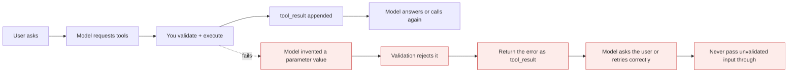
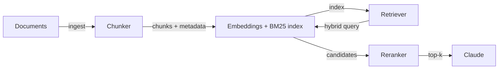

# Tool use, RAG and agentic search

*Module 18 · Track C*

Two ways to give a model knowledge it does not have: let it call your systems, or retrieve the right passage before it answers. Production systems use both, and the failure modes are different.

[Course home](../index.md) / Module 18

## 1. Tool schema design

The schema is a prompt. The model chooses a tool by reading the description and fills parameters by reading their descriptions - so vague schemas produce wrong calls.

```json
{
  "name": "search_orders",
  "description": "Search orders by customer email and optional status. Use when the user asks about a customer's order history. Do NOT use for a single known order id - use get_order for that.",
  "input_schema": {
    "type": "object",
    "properties": {
      "email":  { "type": "string", "description": "Customer email, exact match" },
      "status": { "type": "string", "enum": ["open", "shipped", "cancelled"] },
      "limit":  { "type": "integer", "minimum": 1, "maximum": 50, "default": 10 }
    },
    "required": ["email"]
  }
}
```

| Rule | Why |
| --- | --- |
| Say when NOT to use it | Disambiguates overlapping tools better than any positive description |
| Enums over free strings | Removes a whole class of invalid calls |
| Bound the result size | Protects the context window (module 17) |
| Never accept raw SQL or shell | The model is an untrusted caller by design |
| Make writes idempotent | Retries happen; double-charging must not |

**Multi-turn tool conversation**



> **Why it matters:** Parallel tool calls in one turn are normal - handle a list of tool_use blocks, not just the first one, and return every matching tool_result.

## 2. When tools are the wrong answer

A tool is right when the answer lives in a **system** you can query. RAG is right when the answer lives in **text** you have to find. Asking a tool to "search all our documents" with no retrieval layer is just moving the problem.

## 3. RAG, properly

**Production RAG pipeline**



> **Why it matters:** Most bad RAG is bad retrieval, not a bad model. If the right passage never reaches the prompt, no amount of prompt tuning saves the answer.

| Stage | Decisions that matter |
| --- | --- |
| **Chunking** | Split on structure (headings, sections), not blind character counts. Overlap enough to avoid cutting a fact in half. Keep source, page and section as metadata. |
| **Embeddings** | Semantic similarity - finds paraphrases. Blind to exact identifiers and rare tokens. |
| **BM25 / keyword** | Exact terms - error codes, product IDs, function names. Blind to synonyms. |
| **Hybrid** | Run both and fuse the rankings. This is the single biggest quality jump in most systems. |
| **Multi-index** | Separate indexes per corpus (docs, tickets, code) with a router. Prevents one noisy corpus drowning the others. |
| **Reranking** | Retrieve 50, rerank, pass 5. Cheap accuracy - retrieval recall and prompt precision at once. |
| **Contextual retrieval** | Prepend a short document-level context sentence to each chunk before embedding, so an isolated chunk still knows what it belongs to. Big win on fragmented corpora. |

> **WARNING - Evaluate retrieval separately from generation**
>
> Measure "was the correct passage in the top-k?" independently of "was the answer good?". Otherwise you spend weeks tuning prompts to compensate for a retriever that never returned the right chunk.

## 4. Agentic search

Instead of a single retrieve-then-answer pass, the model searches, reads, decides it needs something else, and searches again. Better on hard multi-hop questions; slower and costlier on easy ones.

- Bound the number of search iterations.
- Make the search tool return snippets with IDs, not whole documents.
- Log the query trail - it is the only way to debug why the answer went sideways.
- Route: cheap single-pass retrieval for simple questions, agentic search only when the first pass is weak.

## 5. Citations, vision, PDFs

| Capability | Use it for | Trap |
| --- | --- | --- |
| **Citations** | Answers tied to the supplied source spans | Do not let the model free-write references - they are exactly where fabrication lives |
| **Vision** | Screenshots, diagrams, charts, scanned forms | Images are expensive in tokens; resize before sending |
| **PDF input** | Documents with layout that matters | Long PDFs blow the window - chunk and retrieve instead of dumping |

## 6. Caching and batching in a RAG system

- **Cache the stable prefix** - system prompt, tool definitions, and any long reference block that does not change between calls. Keep the order byte-identical or you get a miss.
- **Batch the ingestion** - embedding and contextualising a corpus is offline work; the batch endpoint is roughly half price.
- **Semantic cache the answers** - repeat questions are extremely common in support workloads.
- **Do not cache what changes** - a cached prefix containing today's date or a user ID never hits.

> **PRACTICE - Practice now**
>
> 1. Write a tool schema with an enum, a bounded limit and an explicit "do not use when" line.
> 2. Handle a turn with two parallel tool_use blocks and return both results.
> 3. Build a tiny RAG over 50 documents with embeddings only. Note what it misses.
> 4. Add BM25 and fuse the rankings. Measure retrieval recall before and after.
> 5. Add a reranker: retrieve 50, pass 5. Measure again.
> 6. Add contextual retrieval to the chunks and measure a third time.
> 7. Turn on prompt caching for the stable prefix and record the cost difference over 20 calls.

> **ASSIGNMENT - Assignment**
>
> Build a cited question-answering system over a real corpus of your own. Requirements: hybrid retrieval, reranking, per-answer citations pointing at real chunk IDs, a retrieval-recall metric reported separately from answer quality, and a cost-per-query figure. Then write down which single change moved recall the most - that answer is what interviewers actually want to hear.

## 7. Interview drill

<details>
<summary><b>Embeddings or BM25?</b></summary>

Both. Embeddings catch paraphrase and intent; BM25 catches exact identifiers, error codes and rare terms. Hybrid fusion is the default for production because real queries contain both kinds of signal.

</details>

<details>
<summary><b>What is contextual retrieval and why does it help?</b></summary>

Prepending a short document-level context to each chunk before embedding, so a chunk that says "this dropped 12%" still carries which metric and which document it came from. It fixes the ambiguity that isolated chunks otherwise lose.

</details>

<details>
<summary><b>Answers are wrong but the prompt looks fine. Where do you look?</b></summary>

Retrieval. Check whether the correct passage was in the top-k at all. If it was not, tune chunking, hybrid search and reranking - prompt changes cannot recover information that never reached the model.

</details>

<details>
<summary><b>How do you stop fabricated citations?</b></summary>

Never let the model author references. Return chunks with IDs, instruct it to cite only those IDs, and validate that every cited ID exists in the retrieved set before showing the answer.

</details>

<details>
<summary><b>When is agentic search worth it over single-pass RAG?</b></summary>

Multi-hop questions where the second query depends on the first result. Bound the iterations and route to it selectively - on simple lookups it adds latency and cost for no gain.

</details>

---

[← Module 17](17-platform-console-agent-loop.md) &nbsp;&nbsp;|&nbsp;&nbsp; [Module 19: Agents & workflows →](19-agents-workflows.md)

---

Claude AI: Zero to Architect · Himanshu Kumar.
