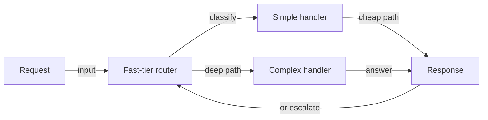
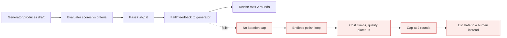

# Agents and workflows

*Module 19 · Track C*

Six patterns cover almost every system you will build. Choosing the simplest one that works is the actual skill - most "agent" projects should have been a workflow.

[Course home](../index.md) / Module 19

## 1. Workflow or agent?

|  | Workflow | Agent |
| --- | --- | --- |
| Control flow | You define the steps in code | The model decides the next step |
| Predictability | High - same path every time | Lower - path varies per input |
| Cost | Bounded and knowable | Variable; needs caps |
| Debugging | Straightforward | Needs full trajectory tracing |
| Use when | The steps are known in advance | The steps genuinely depend on what is found |

> **TIP - Default to the workflow**
>
> If you can draw the flowchart, build the flowchart. Autonomy is a cost you pay for handling unknown paths - not a feature you add because agents sound better in a status update.

## 2. The five workflow patterns

### Prompt chaining

Output of step one becomes input of step two. Use when a task decomposes cleanly - extract, then classify, then summarise. Add a validation gate between steps so a bad step one does not silently poison step three.

### Routing

**Routing: cheap classifier in front**

> **Why it matters:** A small model deciding which big model to call is the highest-leverage cost optimisation in most systems - but the router itself needs an eval, because a misroute is invisible until quality drops.

### Parallelisation

Two shapes: **sectioning** - split independent subtasks, run them concurrently, merge; and **voting** - run the same task several times and take consensus for high-stakes judgements. Both cost more; use them where latency or reliability justifies it.

### Orchestrator-worker

A lead model decomposes a task at runtime and dispatches workers. Use when the subtasks are not known in advance - "review this repo" needs different workers than "review this PDF". This is the API-level version of module 06.

### Evaluator-optimiser

One model produces, another critiques against explicit criteria, the first revises. Genuinely effective when you have clear criteria (does it compile, does it match the schema, does it cite sources). Cap the iterations - two rounds captures most of the gain.

**Evaluator-optimiser loop**

> **Why it matters:** Without explicit criteria, the evaluator just rewrites in its own style forever. The criteria are the pattern - the second model is only the mechanism.

### Autonomous agent

The model plans, acts, observes and repeats until done. Everything in modules 03-08. Requires: bounded steps, bounded spend, scoped permissions, a verification signal, and a human on irreversible actions.

## 3. Computer use

Driving a UI - clicking, typing, reading the screen - when there is no API. Powerful and genuinely fragile:

- Run it in a container or VM, never on a machine with real credentials.
- Whitelist the applications and domains it may touch.
- Expect brittleness - a UI change breaks the flow silently.
- Treat it as the last resort: API > MCP server > scripted automation > computer use.

## 4. Debugging an agent

| Symptom | Likely cause | Where to look |
| --- | --- | --- |
| Loops on the same tool | Tool result does not answer the question | Tool output content - is it empty, truncated, or an unhandled error? |
| Stops too early | Weak definition of done | Give an explicit completion criterion and a verification command |
| Picks the wrong tool | Overlapping descriptions | Add "do not use when" clauses to each schema |
| Great in testing, bad in production | Real inputs are messier | Rebuild the eval set from production traffic |
| Costs spike randomly | Retry storms or unbounded tool output | Per-step token logs; cap output and retries |

> **WARNING - Log the trajectory, not just the answer**
>
> For every run: each step, tool name, arguments, result size, tokens, latency and stop_reason. Without the trajectory you are debugging a black box, and "it sometimes goes wrong" is not a bug report you can act on.

## 5. The Agent SDK

The same harness that powers Claude Code, available for your own agents - loop, tool dispatch, permissions, sub-agents and session handling. Build on it when you want Claude Code's behaviour inside your product; build the loop yourself when your control flow is unusual enough that the abstraction fights you.

> **PRACTICE - Practice now**
>
> 1. Take one feature and implement it as a chain, then as an agent. Compare cost, latency and failure modes.
> 2. Add a fast-tier router in front and measure the spend change over 50 real inputs.
> 3. Build an evaluator-optimiser with three explicit criteria and a two-round cap.
> 4. Instrument full trajectory logging, then deliberately break a tool and read the trace.
> 5. Write down, for your own use case, the honest answer to "does this need an agent at all?"

> **ASSIGNMENT - Assignment**
>
> Produce a design doc for one real system: which pattern, why the simpler pattern was rejected, the tool inventory with schemas, the step and spend caps, the eval set and baseline, the trajectory logging plan, and the human checkpoints. Then build it. The doc is the interview material; the build is the proof.

## 6. Interview drill

<b>When would you refuse to build an agent?</b>

When the steps are known in advance - then it is a workflow and an agent only adds variance, cost and debugging difficulty. Also when there is no verification signal, because an autonomous loop with no way to check itself cannot be trusted at any level of autonomy.

<b>Explain orchestrator-worker versus parallel sectioning.</b>

Sectioning splits a task you already know how to divide, statically. Orchestrator-worker lets a lead model decide the decomposition at runtime because it depends on the input. Use sectioning when the structure is fixed; orchestration when it is not.

<b>Your agent loops forever on one tool. Diagnosis?</b>

The tool result is not moving it forward - usually empty results, truncation, or a swallowed error. Return informative errors as tool_result, cap steps, and add an explicit completion criterion so it knows what done looks like.

<b>Where does computer use sit in your toolbox?</b>

Last resort, in a sandbox. Prefer an API, then an MCP server, then scripted automation. Computer use is for systems with no programmatic access, and it needs isolation because it acts with whatever the desktop can reach.

---

[← Module 18](18-tool-use-rag.md) &nbsp;&nbsp;|&nbsp;&nbsp; [Module 20: MCP advanced →](20-mcp-advanced.md)

---

Claude AI: Zero to Architect · Himanshu Kumar.
