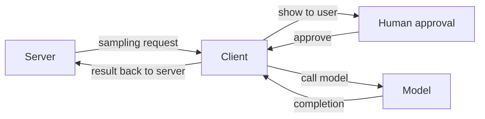
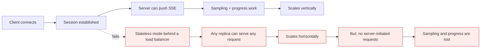

# MCP: advanced topics

*Module 20 · Track D*

Module 10 connected a server. This one is the protocol itself - the features that make a server genuinely useful, and the transport decisions that decide whether it scales.

[Course home](../index.md) / Module 20

## 1. Sampling: the server asks the client for a model call

Normally the client calls the model and the server just answers tool calls. **Sampling** inverts one piece: the server can request a completion *through the connected client*.

**Sampling flow**

> **Why it matters:** The server needs no API key and pays no inference cost - the client does. That is the whole point: cost and model choice stay with the user, not with every server author.

| Why it matters | Detail |
| --- | --- |
| Cost shifts to the client | Server authors do not need their own model billing |
| The user keeps control | Requests can be surfaced for approval before they run |
| Servers stay thin | Summarise, classify or extract without embedding an AI stack in the server |
| Trust boundary | A server could ask for anything - clients should show and gate these requests |

## 2. Progress notifications and logging

Long-running tools go silent, and silence looks like a hang. MCP has one-way **notification** messages for exactly this - progress updates and log lines that need no reply.

- Report progress with a current/total pair so a client can render a real bar.
- Emit structured log messages at sensible levels rather than printing to stdout - on stdio transport, stray stdout output corrupts the protocol stream.
- Long jobs with no feedback get cancelled by users who assume they are stuck.

## 3. Roots: scoped filesystem access

**Roots** let a client tell a server which directories it may work in. The server discovers the allowed locations instead of guessing paths, and the boundary is explicit.

> **TIP - Roots are a security feature dressed as a convenience**
>
> Without them a filesystem server has to be told paths and can be talked into wandering. With them, the client declares the sandbox and file discovery stays inside it.

## 4. The message layer

| Message type | Shape | Used for |
| --- | --- | --- |
| **Request / result** | Has an id; expects a response | Tool calls, listing tools, reading resources |
| **Notification** | No id; no response | Progress, logs, "the tool list changed" |
| **Error** | Result carrying an error object | Failed calls, with a code and message |

Communication is **bidirectional**: servers can initiate requests to clients too - which is exactly how sampling works.

## 5. Transports

### stdio

Client launches the server as a subprocess and talks over standard input and output. Ideal for local tools: no ports, no auth layer, process lifetime tied to the client.

| Detail | Consequence |
| --- | --- |
| Initialization handshake is required | Capabilities are exchanged before any tool call - skip it and nothing works |
| stdout is the protocol channel | Never `print()` in a stdio server; log to stderr or via the protocol |
| One client, one process | No horizontal scaling - by design |

### Streamable HTTP and SSE

For remote servers. HTTP carries client-to-server requests; Server-Sent Events give the server a channel to push to the client - needed for notifications and server-initiated requests such as sampling.

**Stateful vs stateless remote server**

> **Why it matters:** Stateless HTTP buys horizontal scaling and costs you the features that need a persistent connection. Decide which you need before you pick, because retrofitting is painful.

| Requirement | Transport |
| --- | --- |
| Local dev tool, single user | stdio |
| Shared team server with progress and sampling | Streamable HTTP, stateful sessions |
| High-volume service behind a load balancer | Stateless HTTP - accept the feature loss |
| Cross-network, multiple orgs | Remote HTTP with proper auth and per-tenant scoping |

> **WARNING - Configuration flags silently change what works**
>
> Turning off session state or streaming does not raise an error - it just makes server-initiated features unavailable. If sampling or progress "stopped working" after a deployment change, check the transport configuration before you debug the code.

## 6. Production concerns

- **Auth.** Remote servers need real authentication and per-user scoping. Never a single shared god-token.
- **Multi-tenancy.** One user's roots and credentials must never leak into another's session.
- **Timeouts and cancellation.** Support cancellation, or a runaway tool holds the session forever.
- **Versioning.** Changing a tool's schema breaks every client. Add, deprecate, then remove.
- **Observability.** Log every tool call with caller, arguments and duration - this is your audit trail.
- **Result size.** Cap it at the server. The client's context window is a shared resource you are spending.

> **PRACTICE - Practice now**
>
> 1. Add progress notifications to a long-running tool and watch them render in a client.
> 2. Implement a sampling request in a server and observe the approval prompt on the client side.
> 3. Add roots support and verify the server refuses paths outside the declared directories.
> 4. Run the same server over stdio, then over HTTP with sessions, then stateless. Note which features stop working.
> 5. Deliberately `print()` in a stdio server and watch the protocol break - then fix it properly.

> **ASSIGNMENT - Assignment**
>
> Take the read-only server from module 10 and make it production-grade: progress notifications, roots-scoped file access, capped results, cancellation support, structured logging, and a documented transport choice with the trade-off written down. Then deploy it remotely with authentication and connect from a second machine.

## 7. Interview drill

<b>What is sampling and why does it exist?</b>

A server requesting a model completion through the connected client. It keeps inference cost, model choice and user consent on the client side, so server authors can use a model without shipping API keys or an AI stack.

<b>Request versus notification?</b>

Requests carry an id and expect a result; notifications carry no id and expect nothing back. Progress and log messages are notifications, which is why they can flow freely during a long operation without blocking.

<b>Why can't a stateless HTTP MCP server do sampling?</b>

Sampling is server-initiated and needs a persistent channel back to a specific client session. Stateless mode exists so any replica can serve any request behind a load balancer - which is precisely what removes that channel.

<b>What do roots solve?</b>

Scoped file access. The client declares which directories the server may touch, so file discovery is both safe and convenient instead of the server being handed arbitrary paths.

<b>Most common stdio bug?</b>

Writing to stdout. That stream is the protocol channel, so a stray print corrupts messages. Log to stderr or through protocol logging notifications.

---

[← Module 19](19-agents-workflows.md) &nbsp;&nbsp;|&nbsp;&nbsp; [Module 21: AI-native SDLC →](21-ai-native-sdlc.md)

---

Claude AI: Zero to Architect · Himanshu Kumar. Protocol details evolve - check the current MCP specification.
