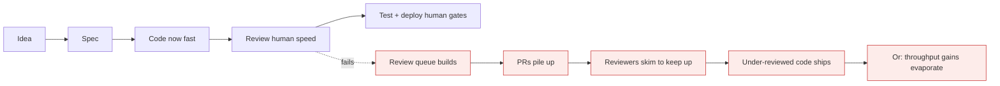
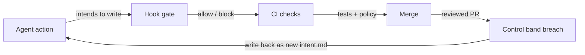

# The AI-native SDLC

*Module 21 · Track E*

Code generation got ten times faster. Planning, review, testing and deployment did not. This module is about the processes around the code - which is where the gains are now won or lost.

[Course home](../index.md) / Module 21

## 1. The new bottleneck

**Where the queue moved**



> **Why it matters:** Adding agents without changing review is how a team gets faster at producing work nobody has capacity to check. The unreviewed backlog is the risk, not the model.

## 2. Capture intent before code

The practice that pays off first: a short, version-controlled `intent.md` stating what is wanted, why, and under which constraints - written before anything is generated.

```text
# intent.md - Bulk invoice export

## What
Let finance export filtered invoices to XLSX from the admin UI.

## Why
Manual CSV wrangling costs ~6 hours per month-end close.

## Constraints
- Must respect existing row-level permissions - no widening of access.
- Max 50k rows per export; larger requests must be queued, not blocked.
- No new third-party dependency without architecture review.

## Definition of done
- Endpoint + UI behind the `bulk_export` feature flag
- Tests for permissions, row cap, and queueing
- Runbook entry for the queue worker

## Explicitly out of scope
Scheduled/recurring exports. Separate intent.
```

From that file, one working session with Claude produces a requirements and design spec. Because the intent is versioned, you can later diff what was asked against what was built - which is exactly what an auditor wants.

> **TIP - Why this beats a ticket**
>
> A ticket describes a task. `intent.md` describes the boundary conditions an agent must not cross, in a machine-readable file that lives next to the code and gets reviewed like code.

## 3. Institutional knowledge as versioned files

| Artifact | Holds | Reviewed like |
| --- | --- | --- |
| `CLAUDE.md` | Architecture, commands, conventions, landmines | Code - changes go through PR |
| Skills | Repeatable procedures with output contracts | Code - with an owner per skill |
| Sub-agent definitions | Specialised roles and their tool scopes | Code - permission changes need scrutiny |
| `intent.md` history | Why the system is shaped this way | Design record |

The point: knowledge that used to live in senior engineers' heads becomes files that both humans and agents read. Onboarding, consistency and agent quality all improve from the same artifact.

## 4. Layered review

You cannot review ten times the code with the same process. Layer it so human attention lands where it matters:

| Layer | Catches | Runs |
| --- | --- | --- |
| **Deterministic** | Format, lint, types, tests, dependency policy | Hooks and CI, always |
| **Agentic review** | Logic issues, missing tests, convention drift, security smells | Automatically on every PR |
| **Human review** | Intent, architecture, risk, regulated and critical paths | Reserved - not spent on style |

> **WARNING - Human review must be reserved, not removed**
>
> In regulated and safety-critical code the human layer is mandatory. What changes is what humans spend it on: never formatting, always intent and risk. If your reviewers are still commenting on naming, the lower layers are not doing their job.

## 5. Continuous evals woven through implementation

- Evals run in CI like tests, not as a one-off before launch.
- Every production failure becomes a permanent eval case.
- Prompts, skills and agent definitions are versioned so a score change is attributable.
- Track quality, cost per completed task and review time as one dashboard - optimising any one alone distorts the others.

## 6. Governance enforced as the AI acts

Policy written in a wiki is a hope. Policy written as a hook is a gate.

**Governance in the loop**



> **Why it matters:** Close the loop: when a control band is breached - too many escaped defects, cost per task too high, review time climbing - that becomes a new intent.md and the process changes. Governance is a feedback system, not a document.

| Control | Implemented as |
| --- | --- |
| Protected paths | PreToolUse hook blocking writes |
| Style and lint | PostToolUse hook, automatic |
| Tests before "done" | Stop hook gating turn completion on a real test run |
| Dependency policy | CI check plus a deny rule on install commands |
| Audit | SessionEnd hook writing a record: who, what, which files, which model |

## 7. Metrics that tell the truth

| Measure | Why |
| --- | --- |
| Lead time from intent to production | The end-to-end number; the only one leadership should care about |
| Review queue depth and age | Early warning that generation outpaced verification |
| Escaped defect rate | Whether speed is costing quality |
| Percentage of PRs passing agentic review unchanged | Whether your CLAUDE.md and skills are actually working |
| Cost per completed task | The unit economics of the whole change |

Note what is missing: lines of code and number of PRs. Those go up automatically and mean nothing.

> **PRACTICE - Practice now**
>
> 1. Write `intent.md` for your next real piece of work before writing any code.
> 2. Generate the design spec from it in one session, then review the spec instead of the code.
> 3. Add an agentic review step to your PR pipeline, capped at the top five findings.
> 4. Add a Stop hook that refuses completion unless the test suite passed.
> 5. Measure review queue depth for two weeks before and after.

> **ASSIGNMENT - Assignment**
>
> Take one team's workflow and produce an AI-native SDLC proposal: where intent is captured, which knowledge files exist and who owns them, the three review layers and what each catches, the hooks that enforce non-negotiables, the eval strategy, and the five metrics with current baselines. Present it as a change to the process, not a request for tooling - that distinction is what gets it approved.

## 8. Interview drill

<details>
<summary><b>Agents made your team 3x faster at writing code. What breaks first?</b></summary>

Review. Everything downstream still runs at human speed, so the queue grows and reviewers start skimming. The fix is layered review - deterministic checks and agentic review first, human attention reserved for intent, architecture and risk.

</details>

<details>
<summary><b>Why capture intent as a file rather than a ticket?</b></summary>

It is versioned, machine-readable, reviewable, and lives beside the code. Agents read it as constraints, humans review it as a design record, and later you can diff what was intended against what shipped.

</details>

<details>
<summary><b>How do you enforce policy on an agent in a regulated environment?</b></summary>

Mechanically. Hooks as approval gates, CI as a hard check, protected paths, deny rules, and an audit record per session. Instructions are guidance; hooks and pipelines are controls - and only controls survive an audit.

</details>

<details>
<summary><b>Which metrics prove the transformation worked?</b></summary>

Lead time from intent to production, escaped defect rate, review queue age, and cost per completed task. Volume metrics like PR count or lines of code rise automatically and prove nothing.

</details>

---

[← Module 20](20-mcp-advanced.md) &nbsp;&nbsp;|&nbsp;&nbsp; [Module 22: Enterprise rollout →](22-enterprise-rollout.md)

---

Claude AI: Zero to Architect · Himanshu Kumar. Structure follows Anthropic's AI-Native SDLC Playbook.
