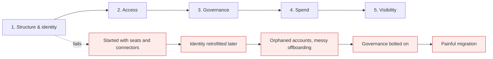

# Enterprise rollout

*Module 22 · Track E*

Five decisions determine whether Claude becomes infrastructure at your company or a pile of individual subscriptions nobody governs. They depend on each other, so the order matters.

[Course home](../index.md) / Module 22

## 1. The five decisions, in dependency order

**Decision order (each one constrains the next)**



> **Why it matters:** Identity first, always. Every later decision - who has access, who is governed, whose spend, whose activity - is expressed in terms of identity. Getting it wrong is the expensive one to reverse.

## 2. Decision 1 - Structure and identity

| Choice | Question | Cost of changing later |
| --- | --- | --- |
| One organisation or several | Do subsidiaries or regions need hard separation? | **High** - splitting later means migrating users and content |
| SSO and directory sync | Is identity owned by your IdP, or by email invitations? | Medium - but invitation sprawl is painful to unwind |
| Domain capture | Do personal accounts on the company domain get absorbed? | Medium - and it surfaces shadow usage you did not know about |
| Workspace / team layout | Mirror the org chart, or mirror how work actually flows? | Low to medium |

> **TIP - Do domain capture early**
>
> People are already using AI on their work email. Capturing those accounts brings shadow usage under governance instead of leaving it invisible - and it is far easier before the population grows.

## 3. Decision 2 - Access

- **Who gets a seat, and in what order?** A staged rollout with a real pilot beats company-wide day one.
- **Which surfaces?** Chat for everyone is a different risk profile from Claude Code with repo access.
- **Which connectors and data sources?** Every connector widens what the assistant can see - approve them deliberately, and confirm they respect existing permissions.
- **Guests and contractors.** Decide before someone asks at 5pm on a Friday.

> **WARNING - Connectors are the permission question, not the feature question**
>
> Retrieval must inherit the underlying system's access controls. If it does not, you have built a way for people to read documents they were never entitled to see - and it will surface in an audit, not a bug report.

## 4. Decision 3 - Governance

| Area | What to decide |
| --- | --- |
| Acceptable use | Which data classifications may be used where; what is prohibited outright |
| Data handling | Retention, residency, what your plan does and does not do with inputs - get this in writing |
| Agent autonomy | Which permission modes are allowed on which repos; who may run unsupervised sessions |
| Shared artifacts | Review process for team skills, plugins, MCP servers and sub-agents |
| Disclosure | When AI assistance must be declared - in code, in documents, with clients |
| Incident response | What happens when something leaks or an agent does damage; who is on call |

## 5. Decision 4 - Spend

- **Seats versus API.** Internal productivity is a seat cost; customer-facing features are variable API cost. Budget them separately or the finance conversation goes badly.
- **Caps and alerts.** Per workspace, with alerting before the ceiling - not at it.
- **Chargeback model.** Central budget, or per business unit? Decide before the first big invoice.
- **The failure mode.** An agent bug that loops is the most common overspend, and it happens outside working hours. Caps are the control; monitoring is the detection.

## 6. Decision 5 - Visibility

| Signal | Answers |
| --- | --- |
| Active users and depth of use | Is it adopted, or bought and ignored? |
| Usage by team and surface | Where is the value concentrating? Who needs enablement? |
| Spend per team over time | Is unit cost improving as people get better at it? |
| Audit events | Who did what, when - the evidence for security and compliance |

> **TIP - Set the success metric before the pilot, not after**
>
> "People like it" is not a renewal case. Pick two or three outcome measures - cycle time, hours returned, tickets deflected - and baseline them in week zero, while you still can.

## 7. How the decisions cascade

| Change this | And this moves |
| --- | --- |
| Split into two organisations | Access lists, governance policies, spend caps and reporting all fork |
| Enable a new connector | Governance review needed; visibility must cover the new data path |
| Loosen agent autonomy | Governance controls and audit requirements both increase |
| Move from seats to heavy API use | Spend model, caps and chargeback all change shape |

## 8. The rollout plan you keep

Record each decision in one living document: **what you decided**, **who owns it**, **when it is revisited**, and **what it would cost to change**. That document is what you walk stakeholders through at kickoff, and what your successor reads on day one.

```text
# Claude rollout plan

## 1. Structure & identity
Decision: single org, SSO via Okta, directory sync on, domain capture enabled
Owner: IT Identity  |  Review: quarterly  |  Reversal cost: HIGH

## 2. Access
Decision: Phase 1 engineering (Code + Chat), Phase 2 ops (Chat + Cowork), guests denied
Owner: Platform lead  |  Review: end of each phase  |  Reversal cost: LOW

## 3. Governance
Decision: no restricted data in any surface; agent autonomy capped at plan+accept-edits
          on non-production repos; team plugins require security review
Owner: Security  |  Review: monthly during pilot  |  Reversal cost: MEDIUM

## 4. Spend
Decision: per-workspace caps, alert at 70%, chargeback per business unit from Q3
Owner: Finance partner  |  Review: monthly  |  Reversal cost: LOW

## 5. Visibility
Decision: weekly adoption + spend review; audit export to SIEM
Owner: Platform lead  |  Review: continuous  |  Reversal cost: LOW
```

> **PRACTICE - Practice now**
>
> 1. Draft the five decisions for your own organisation, even hypothetically.
> 2. For each, write the reversal cost. Notice which ones you must get right first time.
> 3. List every connector someone will ask for and decide the approval bar now.
> 4. Define the pilot's success metrics and baseline them today.
> 5. Write the incident runbook: an agent damaged something - what happens in the first hour?

> **ASSIGNMENT - Assignment**
>
> Produce a complete rollout plan for a fictional 500-person company: all five decisions, owners, review cadence, reversal costs, a phased access plan, the governance policy, spend model with caps, and the metrics dashboard. Then write the one-page version you would present to an executive - the compression is the hard part.

## 9. Interview drill

<details>
<summary><b>Which of the five decisions is hardest to reverse, and why?</b></summary>

Structure and identity. Everything else is expressed in terms of it, so splitting or re-federating later means migrating users, content and policy simultaneously. Access and spend decisions are comparatively cheap to change.

</details>

<details>
<summary><b>Security asks how you prevent data leakage in a rollout.</b></summary>

Layered: identity through SSO with proper offboarding, data classification rules on which surfaces may be used, connectors that inherit source permissions, agent autonomy caps with deny rules on secrets, audit events exported to the SIEM, and a documented incident path. Then a bounded pilot with a review date.

</details>

<details>
<summary><b>How do you justify renewal after a pilot?</b></summary>

Outcome metrics baselined at week zero - cycle time, hours returned, deflection rate - alongside adoption depth and cost per completed task. Satisfaction scores support the case but never carry it.

</details>

<details>
<summary><b>A team wants full autonomy on production repos. Your answer?</b></summary>

No, and here is the alternative: bounded autonomy on non-production repos, agentic changes landing as reviewed PRs, hooks enforcing tests, and no production credentials in the agent's environment. Then revisit with data from that arrangement rather than arguing in the abstract.

</details>

---

[← Module 21](21-ai-native-sdlc.md) &nbsp;&nbsp;|&nbsp;&nbsp; [Module 23: Bedrock & Vertex AI →](23-bedrock-vertex.md)

---

Claude AI: Zero to Architect · Himanshu Kumar. Five-decision frame follows Anthropic's enterprise deployment course; admin features vary by plan.
