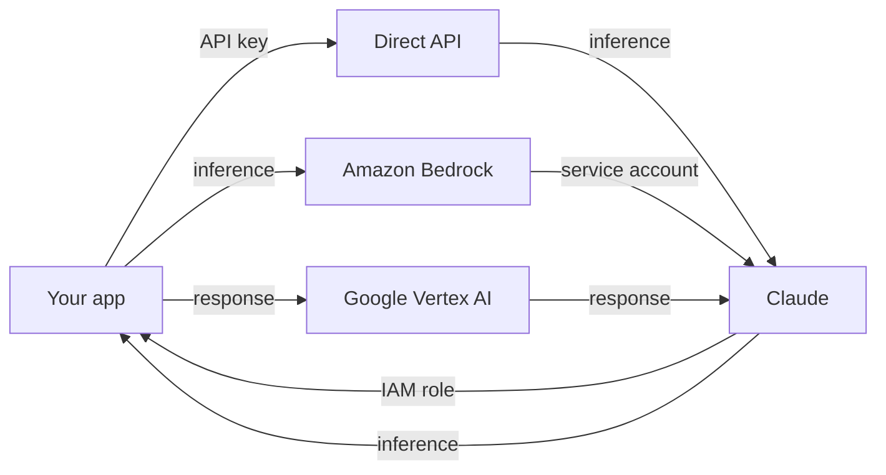

# Claude on Bedrock and Vertex AI

*Module 23 · Track C*

Same models, three front doors. The difference is not capability - it is procurement, identity, data residency and which team already owns the bill.

[Course home](../index.md) / Module 23

## 1. Why an enterprise picks a cloud endpoint

| Driver | Detail |
| --- | --- |
| **Procurement** | It lands on an existing cloud commitment instead of a new vendor contract. |
| **Identity** | IAM roles or service accounts instead of a separate API key to rotate and audit. |
| **Data residency** | Region pinning to satisfy a regulator or a client contract. |
| **Network** | Private connectivity, no public internet egress from the workload. |
| **Consolidated billing** | One cloud invoice, existing tagging and chargeback. |

Direct API wins on the opposite axis: newest features and models tend to land there first, and there is one less layer between you and the behaviour you are debugging.

**Same model, three doors**



> **Why it matters:** The model is the same. What changes is authentication, region behaviour, model identifiers, and how quickly new features arrive.

## 2. What actually differs in your code

| Concern | Direct API | Bedrock | Vertex AI |
| --- | --- | --- | --- |
| Auth | `ANTHROPIC_API_KEY` | AWS credentials / IAM role | Google service account / ADC |
| Client | `Anthropic()` | `AnthropicBedrock()` | `AnthropicVertex()` |
| Model id | Anthropic model name | Bedrock model / inference profile id | Vertex publisher model id |
| Region | Managed for you | Explicit region; cross-region inference profiles | Explicit region/location |
| Quotas | Anthropic rate limits | AWS service quotas per region | GCP quotas per region |
| Feature timing | First | Usually later | Usually later |

```python
# Direct
from anthropic import Anthropic
client = Anthropic()

# Bedrock  (credentials from the standard AWS chain)
from anthropic import AnthropicBedrock
client = AnthropicBedrock(aws_region="us-east-1")

# Vertex AI  (credentials from application default credentials)
from anthropic import AnthropicVertex
client = AnthropicVertex(project_id="my-project", region="us-east5")

# The call itself is identical across all three:
resp = client.messages.create(
    model=MODEL_ID,                # the ONE thing that must be configurable
    max_tokens=1024,
    messages=[{"role": "user", "content": "hello"}],
)
```

> **TIP - Build the seam on day one**
>
> One factory function that returns a configured client, and model IDs in config. Then moving from direct API to Bedrock for a regulated client is a deployment change, not a refactor - and you can run a pilot on one while production stays on the other.

```python
def make_client():
    backend = os.environ.get("LLM_BACKEND", "direct")
    if backend == "bedrock":
        return AnthropicBedrock(aws_region=os.environ["AWS_REGION"])
    if backend == "vertex":
        return AnthropicVertex(project_id=os.environ["GCP_PROJECT"],
                               region=os.environ["GCP_REGION"])
    return Anthropic()
```

## 3. Regions and cross-region inference

- **Capacity lives per region.** A region with little capacity throttles under load even if your quota looks fine.
- **Cross-region inference** spreads traffic across a set of regions for better throughput and resilience - but requests may be served outside your primary region, which is a **data residency decision**, not a performance tweak.
- **Latency follows geography.** Put inference near your users or near your data, and measure rather than assume.
- **Model availability varies by region.** Verify the model you designed around exists where you intend to deploy - before the design review, not after.

> **WARNING - The residency trap**
>
> Teams enable cross-region inference for throughput, then discover in an audit that requests were processed outside the contracted region. If a contract or regulator pins your data, that setting is a compliance control - document the decision.

## 4. Feature parity

| Feature | Expect |
| --- | --- |
| Messages, streaming, system prompts | Available everywhere |
| Tool use | Available everywhere - this is the core pattern, and it ports |
| Vision, PDF, extended thinking | Generally available; confirm per platform and model |
| Prompt caching, batch | Support and semantics can differ - verify before you build the cost case on it |
| Newest models and features | Direct API first; cloud endpoints follow |
| Built-in Anthropic-hosted tools | Most likely to differ - check before designing around them |

## 5. Everything else is the same

Worth stating plainly, because it is the reason this module is short: prompting (module 16), tool use and RAG (module 18), agent architecture (module 19) and MCP (modules 10 and 20) are **identical** across all three. The platform choice changes plumbing, not design. That is exactly why the abstraction seam is cheap to build and expensive to skip.

## 6. Choosing

| Choose | When |
| --- | --- |
| **Direct API** | You want the newest capabilities, simplest debugging, and no cloud constraint. |
| **Bedrock** | Your workload and data already live in AWS; IAM and VPC boundaries are required. |
| **Vertex AI** | You are a GCP shop; identity, networking and billing are already there. |
| **Two of them** | Regulated client on one, everything else on another - viable only if you built the seam. |

> **PRACTICE - Practice now**
>
> 1. Run the same prompt through the direct API and one cloud endpoint. Diff the responses and the latency.
> 2. Implement the `make_client()` seam and switch backends with an environment variable only.
> 3. Run your tool-use example unchanged on the cloud endpoint to prove the pattern ports.
> 4. Check model availability in two regions and note the difference.
> 5. Measure p50 and p95 latency from your actual deployment region.

> **ASSIGNMENT - Assignment**
>
> Write a platform decision record for a real or fictional regulated workload: the driver, the residency requirement, the chosen endpoint, the feature gaps you accepted, the abstraction seam, and the migration path if the decision reverses. One page. This is exactly the artifact an architecture review board expects.

## 7. Interview drill

<details>
<summary><b>Client demands EU data residency. What changes in your design?</b></summary>

Endpoint and region selection become compliance controls: pin the region, disable or explicitly scope cross-region inference, verify model availability there, confirm data handling terms in writing, and document the decision. The prompts, tools and agent architecture do not change at all.

</details>

<details>
<summary><b>Why abstract the client early?</b></summary>

Because the platform decision is driven by procurement, security and residency - forces outside your control that change mid-project. A factory function plus configurable model IDs turns that from a refactor into a deployment variable.

</details>

<details>
<summary><b>What is the main downside of a cloud endpoint?</b></summary>

Lag. New models and features generally reach the direct API first, and some Anthropic-hosted capabilities may not be present at all. You trade freshness for integration with your existing identity, network and billing.

</details>

<details>
<summary><b>Where do the surprises usually come from?</b></summary>

Model identifiers, per-region quotas and availability, and feature gaps around caching and batch. Design assuming those differ and verify them in the target region before committing to a cost or latency model.

</details>

---

[← Module 22](22-enterprise-rollout.md) &nbsp;&nbsp;|&nbsp;&nbsp; [Module 24: Salesforce →](24-salesforce-claude-code.md)

---

Claude AI: Zero to Architect · Himanshu Kumar. Platform capabilities and region availability change - verify with each provider before designing around them.
