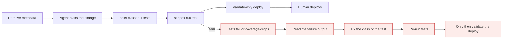
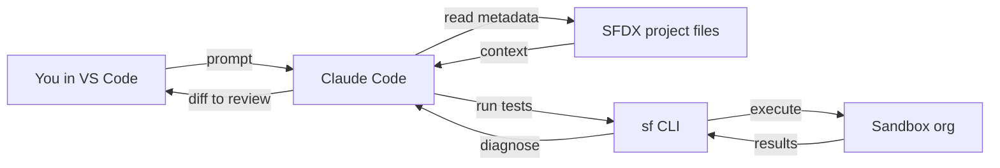

# Claude Code for Salesforce, in VS Code

*Module 24 · Track F · Salesforce*

Salesforce is close to the ideal agentic codebase: enormous metadata, strict runtime limits, a real test requirement and a deployment that can hurt. All four are things an agent can be held to - if you set it up properly.

[Course home](../index.md) / Module 24

## 1. Why this works so well on Salesforce

| Salesforce reality | What the agent does with it |
| --- | --- |
| Thousands of metadata files nobody has read end to end | Explores and explains without you opening a single file |
| Hard runtime limits (SOQL, DML, CPU, heap) | Concrete, checkable review rules - not opinions |
| Apex tests are mandatory for deployment | A real verification signal the loop can run against |
| Deployments are risky and slow | Validate-only runs catch failures before a human waits |
| Declarative + code mixed (Flow, triggers, validation rules) | Cross-cutting impact analysis a grep cannot do |

> **WARNING - Two different things called "agent" - do not mix them up**
>
> **Claude Code agents** work at *development time* on your repo, on your laptop. **Agentforce** agents run *at runtime inside the org*, serving users. This module is entirely about the first. In an interview, conflating them is an instant credibility hit.

## 2. Setup in VS Code

1. VS Code + **Salesforce Extension Pack** + **Salesforce CLI** (`sf`).
2. Open the SFDX project folder (the one with `sfdx-project.json`).
3. Authorise your org: `sf org login web --alias devhub` (or your sandbox alias).
4. Open the integrated terminal in the project root and run `claude`.
5. Trust the folder, then run `/init`.

```text
force-app/main/default/
  classes/          Apex classes + test classes
  triggers/         triggers (thin - logic belongs in handlers)
  lwc/              Lightning web components
  aura/             legacy Aura components
  objects/          fields, validation rules, list views
  flows/            Flow metadata
  permissionsets/   permission sets
manifest/package.xml
sfdx-project.json
.forceignore
```

> **TIP - Retrieve before you ask**
>
> The agent can only reason about metadata that exists on disk. Run `sf project retrieve start --manifest manifest/package.xml` first, otherwise you will get confident answers about a codebase that is half missing.

## 3. CLAUDE.md for a Salesforce project

```text
# CLAUDE.md

## Project
Salesforce DX project. Apex + LWC + Flow. API version 62.0.
Target orgs: `dev` (scratch), `uat` (sandbox). NEVER touch `prod`.

## Commands
- retrieve:  `sf project retrieve start --manifest manifest/package.xml`
- test:      `sf apex run test --test-level RunLocalTests --wait 20 --result-format human`
- one class: `sf apex run test --tests <ClassName> --wait 10 --result-format human`
- validate:  `sf project deploy start --dry-run --test-level RunLocalTests --target-org uat`
- lint:      `npm run lint`  (eslint for LWC)
- jest:      `npm run test:unit`

## Conventions
- Triggers are one per object and contain NO logic - delegate to `<Object>TriggerHandler`.
- All Apex is bulk-safe: no SOQL or DML inside for loops, ever.
- Every class declares sharing explicitly (`with sharing` unless justified in a comment).
- Enforce CRUD/FLS: use `WITH USER_MODE` / `Security.stripInaccessible` on user-driven queries and DML.
- SOQL in dynamic strings must use `String.escapeSingleQuotes()`.
- Test classes: `<ClassName>Test`, `@TestSetup`, real assertions, no `SeeAllData=true`.
- Aim above 85% coverage per class; 75% is the platform floor, not our target.
- LWC: no direct DOM manipulation; use `@wire` where possible; jest test per component.

## Definition of done
`sf apex run test --test-level RunLocalTests` passes AND the validate-only deploy succeeds.

## Never
- Never run a deploy against `prod`.
- Never edit anything under `.sfdx/` or `.sf/`.
- Never print org credentials or access tokens into the session.
```

## 4. Permissions: the Salesforce-specific list

This is the most important configuration in the module. The sf CLI can delete orgs and mass-update data.

```json
{
  "permissions": {
    "allow": [
      "Bash(sf apex run test:*)",
      "Bash(sf project retrieve start:*)",
      "Bash(sf project deploy start --dry-run:*)",
      "Bash(sf apex get log:*)",
      "Bash(sf data query:*)",
      "Bash(npm run lint)",
      "Bash(npm run test:unit)",
      "Bash(git status)", "Bash(git diff:*)"
    ],
    "ask": [
      "Bash(sf project deploy start:*)",
      "Bash(git push:*)"
    ],
    "deny": [
      "Bash(sf org delete:*)",
      "Bash(sf org display:*)",
      "Bash(sf data delete:*)",
      "Bash(sf data update:*)",
      "Bash(sf data import:*)",
      "Bash(sf apex run:*)",
      "Read(./.sfdx/**)",
      "Read(./.sf/**)",
      "Read(./.env)"
    ]
  }
}
```

> **WARNING - The credential trap almost everyone hits**
>
> `sf org display --verbose` prints an **access token** to stdout. If an agent runs it, that live token is now in the conversation, in your logs, and possibly in a transcript you paste somewhere. Deny it. Same reasoning for `sf apex run` (anonymous Apex) - it executes arbitrary code against a real org with no test harness and no diff to review. Keep it on the deny list and run it yourself when you need it.

## 5. Hooks: make the Salesforce rules non-negotiable

```json
{
  "hooks": {
    "PostToolUse": [
      { "matcher": "Edit|Write",
        "hooks": [{ "type": "command",
                    "command": "npx prettier --write $CLAUDE_FILE_PATHS" }] }
    ],
    "PreToolUse": [
      { "matcher": "Bash",
        "hooks": [{ "type": "command",
                    "command": "./scripts/block-prod-deploy.sh" }] }
    ]
  }
}
```

```bash
#!/usr/bin/env bash
# scripts/block-prod-deploy.sh - refuse any command that targets production
if grep -Eq 'target-org[ =]+(prod|production)' <<< "$CLAUDE_TOOL_INPUT"; then
  echo "Blocked: production deployments are human-only." >&2
  exit 1                       # non-zero exit stops the tool call
fi
exit 0
```

> **TIP - Prettier with the Apex plugin is worth ten review comments**
>
> Let the formatter own formatting so both your agentic reviewer and your human reviewer spend their attention on bulkification, sharing and query selectivity instead of brace placement.

## 6. The Salesforce delivery loop

**Apex change, end to end**



> **Why it matters:** The agent's definition of done is a green RunLocalTests plus a successful dry-run deploy. Anything less and you are reviewing guesses.

**Where Claude Code sits in your Salesforce stack**



> **Why it matters:** Every org interaction goes through the sf CLI, which means your permission rules are the control point for everything the agent can do to a real org.

## 7. Tasks that pay off immediately

| Ask | Why it is valuable |
| --- | --- |
| "Explain how OpportunityTrigger and its handler work, including every Flow on Opportunity." | Legacy knowledge transfer across code + declarative in one pass |
| "Write a test class for AccountService with @TestSetup, bulk (200 record) coverage and negative cases." | The most tedious, most skipped work in Salesforce |
| "This deploy failed. Here is the error output - what is the root cause and the minimal fix?" | Deployment error triage is pattern-matching, which the model is excellent at |
| "Find every SOQL query inside a loop in force-app and rank by risk." | Governor-limit incidents, found before they page you |
| "Which fields on Case are not referenced by any Apex, Flow, layout or report type?" | Cross-metadata analysis that manual auditing never finishes |
| "Document this Flow as a numbered decision list a BA can read." | Turns click-built logic into reviewable text |
| "Convert this Aura component to LWC, keeping the same public API." | Mechanical migration with a clear correctness test |

## 8. Context strategy for a big org

- **Scope with the manifest.** Retrieve the packages you are working on, not the entire org.
- **Use `.forceignore`.** Keep profiles and generated metadata out of the working set - profiles alone can be tens of thousands of lines of noise.
- **Delegate wide searches** to a sub-agent so 4,000 metadata files never enter your main context (module 06).
- **One object per session.** "Everything about Opportunity" is a session. "The whole org" is not.
- **Point at exact paths** when you know them - `force-app/main/default/classes/AccountService.cls` beats "the account logic".

## 9. Security notes specific to Salesforce

- **Sandbox only.** The agent's org aliases should never include production. Enforce it with a hook, not a note.
- **No credentials on disk in scope.** Deny `.sfdx/` and `.sf/`; they hold auth material.
- **Customer data stays out.** Do not paste real records into prompts; anonymise or use synthetic data.
- **Review generated SOQL for injection.** Dynamic queries need `String.escapeSingleQuotes()` - a generated query that concatenates user input is a real vulnerability, not a style issue.
- **CRUD/FLS is not optional.** Generated code frequently omits it. That is exactly what your reviewer agent is for (module 25).
- **Managed package code is read-only** - make sure the agent knows it cannot edit it.

> **PRACTICE - Practice now**
>
> 1. Open a real SFDX project in VS Code, retrieve metadata, and run `claude` + `/init`.
> 2. Replace the generated CLAUDE.md with the version above, adapted to your org aliases.
> 3. Add the permission rules. Verify the deny list by asking the agent to run `sf org display --verbose` - it must be blocked.
> 4. Add the prod-deploy blocking hook and test it with a fake prod command.
> 5. Ask for a full walkthrough of your most feared legacy trigger.
> 6. Have it write a test class for an untested service class, then run the tests and let it fix its own failures.
> 7. Run a validate-only deploy and let it triage any error.

> **ASSIGNMENT - Assignment**
>
> Set up one real Salesforce repo end to end: CLAUDE.md, permission rules, prettier hook, prod-deploy block, and a documented "agent workflow" for your team covering what the agent may do, what needs approval, and who deploys. Then take one genuine backlog item from story to validated deploy using the agent, and record how long it took versus your usual estimate.

## 10. Interview drill

<details>
<summary><b>How do you stop an agent damaging a Salesforce org?</b></summary>

Layered: sandbox-only org aliases, deny rules on `sf org delete`, data manipulation commands, anonymous Apex and `sf org display`; a PreToolUse hook that blocks any command mentioning production; deploys as validate-only for the agent and human-run for real; and every change landing as a reviewed diff.

</details>

<details>
<summary><b>Why is Salesforce a particularly good fit for agentic development?</b></summary>

It has a mandatory, runnable verification signal - Apex tests plus validate-only deployment - and its quality rules (bulkification, sharing, CRUD/FLS, query selectivity) are concrete and checkable rather than subjective. That closes the agent's verify stage properly.

</details>

<details>
<summary><b>What is the risk with `sf org display --verbose`?</b></summary>

It prints a live access token into the conversation and logs. Anyone with that transcript can act as that user until it expires. It belongs on the deny list.

</details>

<details>
<summary><b>Claude Code agents versus Agentforce - one line each.</b></summary>

Claude Code agents are development-time assistants working on your repo and CLI. Agentforce agents are runtime agents inside the org serving end users. Different lifecycle, different data, different governance.

</details>

---

[← Module 23](23-bedrock-vertex.md) &nbsp;&nbsp;|&nbsp;&nbsp; [Module 25: Salesforce agents, teams & skills →](25-salesforce-agents-skills.md)

---

Claude AI: Zero to Architect · Himanshu Kumar. sf CLI commands and API versions change - verify against current Salesforce docs.
