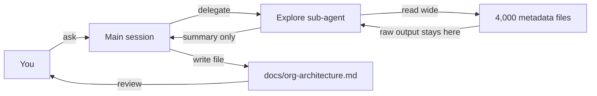
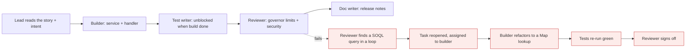

# Salesforce agents, teams and skills

*Module 25 · Track F · Salesforce*

Module 24 wired the tooling up. This one is the payload: exploring an org you inherited, reviewers that know governor limits, a team that ships a release, and skills you invoke from the VS Code terminal.

[Course home](../index.md) / Module 25

## 1. Exploring an org you inherited

The single highest-value first use. Run it in plan mode so nothing gets edited while you are still learning.

```text
> Explore this project and produce an architecture brief:
  1. Objects with the most custom logic (Apex, triggers, flows)
  2. The trigger framework in use, if any, and where it is bypassed
  3. Integrations - named credentials, callouts, platform events
  4. Async work - queueables, batches, scheduled jobs
  5. Anything that looks like a governor-limit risk
  Use the Explore sub-agent for the wide search. Do not edit anything.
  Write the result to docs/org-architecture.md.
```

**Exploration without polluting your context**



> **Why it matters:** The raw metadata never enters your main window. You get a brief, and a file on disk that survives the session.

> **TIP - Ask which agents your org needs**
>
> *"Based on this repo, which sub-agents would give this Salesforce team the most value, and why?"* The answer is grounded in your actual trigger sprawl, test debt and integration surface - far better than a generic list.

## 2. The Apex reviewer (read-only)

This is the agent that earns its keep every single day. Note `tools` - it reports, it never edits.

```markdown
<!-- .claude/agents/apex-reviewer.md -->
---
name: apex-reviewer
description: Use when reviewing Apex classes, triggers or handlers for governor
  limits, bulkification, security and testability. Reports findings only - never edits.
tools: Read, Glob, Grep
model: sonnet
---

You are a senior Salesforce technical architect reviewing Apex. Read-only.

## Check, in this order

1. **Bulkification** - SOQL or DML inside a for loop; queries not bounded by a
   collection; missing `Map`/`Set` patterns for lookups.
2. **Governor limits** - unbounded queries, missing `LIMIT`, non-selective filters,
   heap risk from large collections, recursive trigger paths.
3. **Security** - class sharing declaration; CRUD/FLS enforcement
   (`WITH USER_MODE`, `Security.stripInaccessible`); dynamic SOQL without
   `String.escapeSingleQuotes()`; hardcoded IDs.
4. **Trigger design** - logic in the trigger body instead of a handler; more than one
   trigger per object; no recursion guard.
5. **Async correctness** - `@future` inside a loop, callouts in triggers without async,
   Queueable chaining depth, batch scope size.
6. **Testability** - `SeeAllData=true`, no assertions, no bulk (200 record) case,
   no negative case, `System.runAs` missing for permission-sensitive logic.
7. **API/deprecation** - old API versions, deprecated methods.

## Output
Group by severity (HIGH / MEDIUM / LOW), worst first. For each finding:
file and line, the current code, why it is a problem in this org's context,
and the corrected code.
Maximum 8 findings. If the class is clean, say so - do not invent work.

## Never
- Never comment on formatting handled by prettier.
- Never suggest changes inside managed packages.
```

Two more worth building on day one:

| Agent | Job | Tools |
| --- | --- | --- |
| `lwc-reviewer` | Wire vs imperative, lifecycle misuse, DOM manipulation, accessibility, missing jest tests | Read-only |
| `apex-test-writer` | Writes `@TestSetup`, bulk 200-record, negative and `runAs` cases | Read + Write + Bash(sf apex run test) |
| `metadata-auditor` | Unused fields, orphaned permission sets, duplicate validation rules, unreferenced classes | Read-only |
| `deploy-triager` | Turns a deployment error dump into root cause and minimal fix | Read + Bash(dry-run only) |

> **WARNING - Only the test writer gets write access**
>
> A reviewer with edit rights turns a review into a 30-file refactor you cannot read. Findings and fixes are different jobs - keep them in different agents (module 06).

## 3. An agent team for a release

Sub-agents cannot talk to each other. A Salesforce story usually has real dependencies - the tests cannot be written until the service exists, the docs cannot be written until both are done. That is a team (module 08).

**Story delivered by a four-role team**



> **Why it matters:** Mark the review task blocked by the build task. A reviewer that 'reviews' a file that does not exist yet and reports clean is the failure you must design against.

```text
> Create a team for story SF-412 (bulk-safe Opportunity rollup).
  Teammates:
   - builder      : implement OpportunityRollupService + handler wiring
   - test-writer  : test class, blocked by builder
   - reviewer     : apex-reviewer rules, blocked by test-writer
   - doc-writer   : release note + docs/ update, blocked by reviewer
  Shared task list. Nobody marks a task done until
  `sf apex run test --test-level RunLocalTests` passes.
  Report back to me before any deploy.
```

> **WARNING - Cost reality**
>
> Four teammates coordinating cost several times one agent doing the same work sequentially. Use a team when the dependencies are real and the story is big. For a two-class change, one session is cheaper and usually better.

## 4. Agent views for a Salesforce week

`claude agents` gives one board for the things that should run in parallel:

| Dispatch in parallel | Keep serial |
| --- | --- |
| Metadata audit across the whole repo | Two tasks editing the same handler class |
| Reviewing three unrelated feature branches | Anything running deployments to the same org |
| Documenting Flows on different objects | Test runs competing for the same scratch org |
| Generating test classes for separate services | Sequential git operations on one branch |

Give write-heavy Salesforce tasks their own branch - and their own scratch org if they run tests, otherwise the runs collide.

## 5. Salesforce skills, invoked from the VS Code terminal

A skill packages the procedure **and** the output format, so every review looks the same whoever runs it (module 09). Project-scoped skills live in the repo and ship to the whole team.

```markdown
<!-- .claude/skills/apex-review/SKILL.md -->
---
name: apex-review
description: Review Apex for governor limits, bulkification, security and test
  quality, and return a severity-ranked report. Use when asked to review Apex,
  a trigger, a handler, or a pull request touching force-app/main/default/classes.
allowed-tools: Read, Glob, Grep, Bash(git diff:*)
---

# Apex review

## Input
A class name, a path, or nothing (then review the staged diff via `git diff --staged`).

## Steps
1. Identify the entry point: trigger, handler, service or controller.
2. Trace what runs per record vs per transaction.
3. Apply the checklist: bulkification, limits, sharing, CRUD/FLS, dynamic SOQL,
   recursion, async correctness, test quality.
4. For each finding, produce the corrected code, not just a description.

## Output
| Severity | File:line | Issue | Fix |
Then a "Ship / do not ship" verdict in one sentence.

## Rules
- Maximum 8 findings, highest severity first.
- Never flag formatting. Never touch managed package code.
- If the diff is empty, say so instead of reviewing the whole repo.
```

Inside the VS Code integrated terminal:

```text
/apex-review AccountTriggerHandler
/apex-review                       # reviews the staged diff
/soql-tune OpportunityService      # selectivity + index advice
/deploy-check                      # dry-run deploy + explain any error
/story-to-spec SF-412              # turn a story into a technical spec
```

| Skill worth building | What it standardises |
| --- | --- |
| `apex-review` | Every review, same checklist, same table |
| `test-scaffold` | @TestSetup + bulk + negative + runAs, every time |
| `soql-tune` | Selectivity, indexed fields, LIMIT and pagination advice |
| `flow-doc` | Flow metadata to a numbered decision list a BA can read |
| `deploy-check` | Dry-run, parse errors, propose the minimal fix |
| `story-to-spec` | User story to objects, fields, automation choice and test plan |

## 6. Using it well inside VS Code

- **Terminal in the project root** - Claude Code resolves paths relative to where it started.
- **Review edits as diffs in the editor**, not as text in the terminal. That is where you catch the missing `with sharing`.
- **Keep the Salesforce extension's Problems panel open** - Apex compile errors surface there faster than in a test run.
- **Split terminals**: one running the agent, one for your own `sf` commands.
- **Commit before a big agentic change.** The cheapest undo in Salesforce development is `git checkout .`
- **Skills are project-scoped in `.claude/skills/`** - commit them and the whole team gets the same review standard on their next pull.

## 7. MCP for Salesforce

An MCP server (module 10) lets the agent query org data without you pasting records. Do it carefully:

- **Read-only, sandbox only.** Narrow tools like `describe_object` and `run_soql(limit<=200)` - never a raw query passthrough.
- **Respect FLS.** Query in user mode; the server should not be able to read more than the running user.
- **Cap results.** A 5,000-row response destroys the context window and helps nobody.
- **Log every call** with the requesting user - that log is your audit trail.
- **Never production credentials.** Not even read-only, until you have a documented threat model.

> **PRACTICE - Practice now**
>
> 1. Run the exploration prompt on a real org repo, in plan mode, writing to `docs/org-architecture.md`.
> 2. Create the `apex-reviewer` agent exactly as above and run it on your worst trigger handler.
> 3. Create `apex-test-writer` with test-run access. Let it write a test class and fix its own failures.
> 4. Build the `apex-review` skill and invoke it on a staged diff from the VS Code terminal.
> 5. Run a two-teammate team - builder plus reviewer - on a small real story, with the review task blocked.
> 6. Open `claude agents` and dispatch three read-only audits in parallel.
> 7. Commit `.claude/agents/` and `.claude/skills/` and have a teammate pull and run them.

> **ASSIGNMENT - Assignment**
>
> Ship a "Salesforce agent kit" into a real repo: CLAUDE.md, permission rules, prod-deploy hook, three sub-agents (reviewer, test writer, metadata auditor) and three skills (apex-review, test-scaffold, deploy-check). Then run the reviewer across your ten oldest Apex classes and produce a prioritised technical-debt report with an estimate per item. That report is both a genuinely useful artifact for your team and an excellent architect-interview talking point.

## 8. Interview drill

<details>
<summary><b>How would you use agents to attack technical debt in a legacy Salesforce org?</b></summary>

A read-only reviewer with explicit governor-limit, sharing and CRUD/FLS rules run across the codebase, output ranked by severity into a file; a metadata auditor for unused fields and orphaned permission sets; then a test writer to raise coverage on the highest-risk classes first. Humans decide what gets fixed; the agent finds and proposes, and every change lands as a reviewed diff with green tests.

</details>

<details>
<summary><b>Sub-agent, skill or agent team for a Salesforce release?</b></summary>

Skill for the repeatable procedure and output format. Sub-agent when you need isolation or a restricted tool set - a read-only reviewer. Team only when tasks genuinely depend on each other, such as build then test then review then document, because coordination multiplies cost.

</details>

<details>
<summary><b>What does a Salesforce-specific review agent check that a generic one misses?</b></summary>

Bulkification and SOQL/DML in loops, governor limits and query selectivity, sharing declarations and CRUD/FLS enforcement, dynamic SOQL escaping, trigger framework compliance, recursion control, async patterns, and test quality including bulk and negative cases. A generic code reviewer flags none of these.

</details>

<details>
<summary><b>Why keep the reviewer read-only?</b></summary>

So findings stay reviewable and you choose what to fix. It also bounds the blast radius if the prompt is influenced by untrusted content, and it keeps each diff small enough for a human to actually read.

</details>

---

[← Module 24](24-salesforce-claude-code.md) &nbsp;&nbsp;|&nbsp;&nbsp; [Course home →](../index.md)

---

Claude AI: Zero to Architect · Himanshu Kumar.
